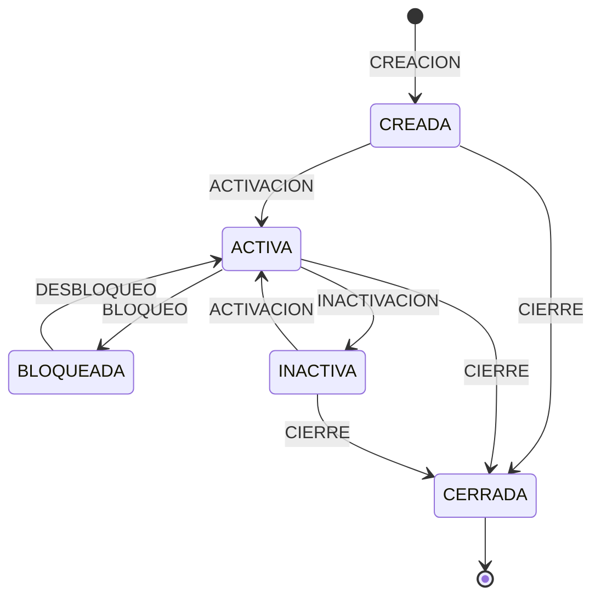
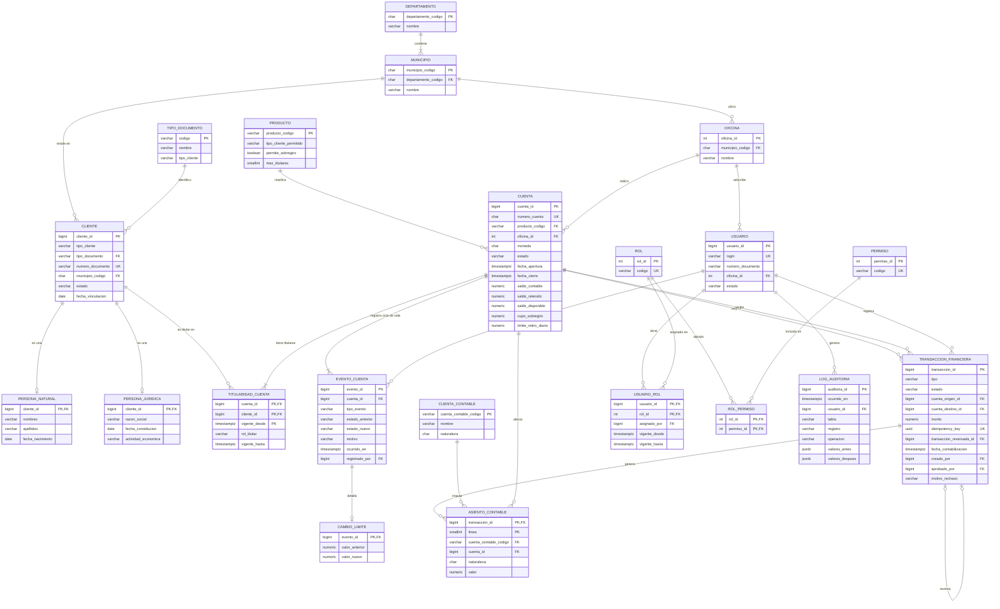

# Entrega G1 — Ingeniería del dominio con IA

| Campo | Valor |
|---|---|
| Proyecto | Laboratorio de Ingeniería de Bases de Datos Relacionales Aumentada con IA — Banco Andino Colombia |
| Gate | **G1 — Ingeniería del dominio con IA** |
| Fecha de entrega | 2026-09-18 |
| Estado | Listo para revisión |
| Integrantes | _(completar con los nombres del equipo)_ |

> **Criterio de aprobación de G1 (documento del laboratorio):** ≥30 reglas verificables; ERD consistente; cliente y usuario separados; eventos y transacciones separados.
> **Evidencia mínima:** `docs/01_especificacion.md` + ERD + matriz de decisiones inicial.

Este archivo reúne toda la entrega de G1: la parte principal presenta los supuestos seleccionados, la resolución de los 7 puntos y la verificación del gate; los anexos contienen la especificación del dominio, el diagrama entidad-relación, la matriz de decisiones sobre IA y el registro de prompts.

## Contenido

**Parte principal**

1. [Supuestos seleccionados](#1-supuestos-seleccionados)
2. [Resolución de los 7 puntos de G1](#2-resolución-de-los-7-puntos-de-g1)
3. [Verificación del gate G1](#3-verificación-del-gate-g1)
4. [Siguientes pasos (G2)](#4-siguientes-pasos-g2--modelo-lógico-y-físico)

**Anexos**

- [Anexo A · Especificación del dominio](#anexo-a--especificación-del-dominio) — actores, entidades, cardinalidades, estados y 54 reglas de negocio
- [Anexo B · Diagrama entidad-relación](#anexo-b--diagrama-entidad-relación) — ERD en Mermaid y su verificación
- [Anexo C · Matriz de decisiones sobre IA](#anexo-c--matriz-de-decisiones-sobre-ia) — 11 decisiones
- [Anexo D · Registro de prompts y respuestas](#anexo-d--registro-de-prompts-y-respuestas) — prompts P-01 a P-05 y Prompt 1 del laboratorio

---

## 1. Supuestos seleccionados

El documento del laboratorio no define cinco aspectos que afectan directamente las reglas de negocio, el modelo y la generación de datos. Para cada uno se evaluaron alternativas y se eligió la que ofrece **mayor calidad del diseño** (reglas claras y verificables, coherencia con la práctica bancaria) y **mayor viabilidad** dentro del alcance y el tiempo del laboratorio.

### Resumen

| ID | Supuesto | Decisión | Reglas |
|---|---|---|---|
| S1 | Operaciones permitidas sobre una cuenta bloqueada | Recibe créditos; no origina débitos. | RN-34, RN-35, RN-43 |
| S2 | Edad mínima para ser titular | 18 años cumplidos a la fecha de apertura. | RN-08 |
| S3 | Máximo de titulares por cuenta | Parámetro del producto: AHORROS 4, CORRIENTE 4, NOMINA 1, EMPRESARIAL 1. | RN-16 |
| S4 | Producto adicional | Cuenta empresarial, exclusiva para personas jurídicas. | RN-12, RN-15 |
| S5 | Alcance del volumen de 1.000.000 de transacciones | Solo transacciones `POSTED`, incluidos reversos y ajustes aprobados. | RN-45 |

### S1 · Cuenta bloqueada

**Supuesto:** ¿una cuenta en estado `BLOQUEADA` puede recibir dinero?

| Alternativa | Evaluación |
|---|---|
| Bloqueo total (no recibe ni envía) | Rechaza pagos legítimos de terceros que desconocen el bloqueo (por ejemplo, un salario) y obliga a devolverlos. |
| **Bloqueo de débitos (recibe, no envía)** | **Seleccionada.** |
| Sin restricción sobre créditos ni débitos | Anula el propósito del bloqueo. |

**Por qué se selecciona:** el objetivo de un bloqueo es impedir que el dinero **salga** de la cuenta (sospecha de fraude, orden de embargo, solicitud del cliente). Recibir fondos no pone en riesgo al titular ni al banco, y rechazarlos genera devoluciones y reclamos innecesarios.

**Cómo fortalece el proyecto:**
- Produce reglas simples y verificables por separado: quién puede enviar (RN-34) y quién puede recibir (RN-35).
- Resuelve de forma explícita un caso límite: un reverso que debite una cuenta bloqueada se rechaza (RN-43), porque el reverso cumple las mismas reglas que cualquier transacción.
- Simplifica la generación de datos en G4: las cuentas bloqueadas siguen recibiendo movimientos entrantes realistas.

### S2 · Edad mínima del titular

**Supuesto:** ¿desde qué edad una persona natural puede ser titular?

| Alternativa | Evaluación |
|---|---|
| **18 años cumplidos a la fecha de apertura** | **Seleccionada.** |
| Permitir menores con representante legal | Exige modelar representantes, su vigencia y sus permisos; aumenta el alcance sin aportar a los criterios del laboratorio. |
| Sin restricción de edad | Regla imposible de justificar ante un escenario bancario. |

**Por qué se selecciona:** en Colombia la mayoría de edad se alcanza a los 18 años. La titularidad de menores requiere un representante legal, entidad que no hace parte del alcance obligatorio del caso.

**Cómo fortalece el proyecto:**
- Regla verificable directamente contra la fecha de nacimiento y la fecha de apertura (RN-08).
- No agrega entidades ni relaciones al modelo.
- Evita almacenar datos de menores de edad, que tienen protección reforzada.
- Los menores de edad quedan documentados como exclusión explícita del alcance.

### S3 · Máximo de titulares

**Supuesto:** ¿cuántos titulares puede tener una cuenta?

| Alternativa | Evaluación |
|---|---|
| Máximo fijo de 4 para todas las cuentas | Contradice el sentido de la cuenta de nómina (pertenece a un empleado) y de la cuenta empresarial (pertenece a una empresa). |
| **Máximo definido por producto** | **Seleccionada:** AHORROS 4, CORRIENTE 4, NOMINA 1, EMPRESARIAL 1. |
| Sin límite | No es verificable ni realista. |

**Por qué se selecciona:** cada producto tiene un propósito distinto y el número de titulares debe reflejarlo. Tratar el máximo como un atributo del producto evita un valor fijo escrito en el código.

**Cómo fortalece el proyecto:**
- Mejora la normalización: el máximo depende del producto y se guarda en el producto, no en cada cuenta.
- Permite cambiar la política sin modificar reglas ni código, solo el catálogo de productos.
- Es coherente con RN-14 y RN-15 (tipo de cliente permitido por producto).
- Esta decisión **modifica** la propuesta inicial de la IA (máximo fijo de 4); ver IA-07 en el [Anexo C](#c3-matriz).

### S4 · Producto adicional

**Supuesto:** el laboratorio exige ahorros, corriente, nómina "y al menos un producto adicional". ¿Cuál?

| Alternativa | Evaluación |
|---|---|
| CDT (depósito a término) | Tiene plazo, tasa y vencimiento, y no admite retiros ni transferencias: requiere un modelo distinto al de cuenta. |
| Ahorro programado | Añade cuotas periódicas y penalizaciones que no aportan a los criterios del laboratorio. |
| **Cuenta empresarial** | **Seleccionada.** |

**Por qué se selecciona:** comparte el mismo ciclo de vida, eventos y tipos de transacción de las demás cuentas, por lo que no exige nuevas entidades. Además, da un papel concreto a las personas jurídicas (15 % de los clientes).

**Cómo fortalece el proyecto:**
- Reutiliza completamente el modelo de cuenta, eventos y transacciones.
- Soporta la distribución exigida en G4: 50.000 cuentas para 10.000 clientes (5 por cliente en promedio) solo es realista si las empresas concentran muchas cuentas.
- Habilita flujos de datos realistas, como pagos de nómina desde cuentas empresariales hacia cuentas de nómina.
- Genera reglas verificables propias (RN-15).

### S5 · Alcance del volumen de 1.000.000 de transacciones

**Supuesto:** ¿qué transacciones cuentan dentro del volumen objetivo?

| Alternativa | Evaluación |
|---|---|
| Todas las filas (incluidas rechazadas y pendientes) | Mezcla operaciones sin efecto financiero con movimientos reales; el volumen contable queda por debajo del objetivo. |
| Solo transferencias, consignaciones y retiros | Excluye reversos y ajustes, que el laboratorio define como transacciones financieras. |
| **Solo `POSTED`, incluidos reversos y ajustes aprobados** | **Seleccionada.** |

**Por qué se selecciona:** el laboratorio pide "1.000.000 transacciones financieras + ledger asociado". Solo las transacciones contabilizadas tienen asientos contables; las rechazadas no mueven dinero ni generan ledger. El reverso aparece en el documento como un tipo más de transacción financiera.

**Cómo fortalece el proyecto:**
- Criterio de conteo inequívoco y verificable con una sola consulta en G4 (transacciones `POSTED` = 1.000.000).
- Coherencia total con la doble partida: cada transacción contada tiene ledger balanceado (RN-46, RN-47).
- Las transacciones rechazadas se generan como volumen adicional, lo que aporta realismo y evidencia de las pruebas negativas sin distorsionar el objetivo (RN-45).

> **Validación:** los cinco supuestos son decisiones adoptadas por el equipo y **no fueron consultados con el docente**; la base de datos y los datos sintéticos ya se construyeron con ellos. Si el docente define otra política, se actualizarán las reglas afectadas indicadas en la tabla resumen y se registrará el cambio en la matriz de decisiones.

---

## 2. Resolución de los 7 puntos de G1

| # | Punto | Resolución | Evidencia | Estado |
|---|---|---|---|---|
| 1 | Reglas de negocio verificables | 54 reglas atómicas con prueba y resultado esperado | [Anexo A, §A.8](#a8-reglas-de-negocio-verificables) | Completo |
| 2 | Supuestos y decisiones abiertas | S1–S5 seleccionados y justificados | [Sección 1](#1-supuestos-seleccionados) · [Anexo A, §A.7](#a7-supuestos-adoptados) | Completo; supuestos adoptados por el equipo (no consultados con el docente) |
| 3 | Prompt 1 y contraste | Salidas del Prompt 1 obtenidas, revisadas y consolidadas | [Registro de prompts](#d8-prompt-1-del-laboratorio--analizar-el-caso) | Completo |
| 4 | Registro de prompts y respuestas | 5 interacciones registradas con errores detectados | [Anexo D](#anexo-d--registro-de-prompts-y-respuestas) | Completo |
| 5 | Matriz de decisiones IA inicial | 11 decisiones: 7 aceptar, 3 modificar, 1 rechazar | [Anexo C](#anexo-c--matriz-de-decisiones-sobre-ia) | Completo |
| 6 | Diagrama entidad-relación | ERD conceptual en Mermaid, verificado contra los criterios | [Anexo B](#anexo-b--diagrama-entidad-relación) | Completo |
| 7 | Especificación consolidada | Especificación única del dominio para G2 | [Anexo A](#anexo-a--especificación-del-dominio) | Completo |

### Punto 1 · Reglas de negocio verificables

**Qué exige el laboratorio:** mínimo 30 reglas verificables; reescribir las ambiguas hasta que lo sean.

**Resolución:**
1. Se partió de una propuesta inicial de 40 reglas.
2. Se aplicó un criterio de verificabilidad: **cada regla evalúa una sola condición y tiene una prueba con resultado binario**.
3. Las reglas compuestas se dividieron en reglas atómicas. Por ejemplo, "una cuenta solo se cierra con saldo en 0 y la fecha de cierre es posterior a la apertura" pasó a ser RN-20 (saldo) y RN-21 (fechas).
4. Se incorporaron las reglas derivadas de los supuestos S1–S5.
5. Cada regla se clasificó por dominio y se le asignó una prueba de uno de dos tipos:
   - **Operación rechazada:** prueba negativa que se ejecutará en G3.
   - **Conteo = 0:** consulta de auditoría que se ejecutará en G6.

**Resultado:** 54 reglas (RN-01 a RN-54), distribuidas en clientes y geografía (10), productos y cuentas (12), eventos (7), transacciones (16), contabilidad (3) y seguridad y auditoría (6).

### Punto 2 · Supuestos y decisiones abiertas

**Qué exige el laboratorio:** identificar las decisiones que requieren validación humana.

**Resolución:** se seleccionaron y justificaron los supuestos S1–S5 (sección 1). Además, el Anexo A registra otras decisiones de alcance en su [sección A.10](#a10-decisiones-que-requieren-validación-humana): plan de cuentas contable mínimo, monedas sin conversión, exclusión de créditos, tarjetas, CDT y 4×1000, y distribución de cuentas por tipo de cliente.

**Estado:** los cinco supuestos no se consultaron con el docente; quedan adoptados por el equipo y aplicados en la base de datos. Si el docente los revisa, su respuesta se registrará en la matriz de decisiones.

### Punto 3 · Prompt 1 y contraste con el resultado

**Qué exige el laboratorio:** usar la IA para analizar el caso (Prompt 1) y depurar su respuesta: marcar errores, supuestos y entidades innecesarias.

**Resolución:**
1. Las nueve salidas del Prompt 1 y la autocrítica final se obtuvieron en las sesiones P-01, P-04 y P-05.
2. El equipo revisó cada salida y documentó los problemas encontrados: exceso de alcance con código SQL anticipado, reglas compuestas y máximo fijo de titulares.
3. El resultado depurado quedó consolidado en la especificación. La correspondencia entre cada salida exigida y su ubicación está en el [registro de prompts](#d8-prompt-1-del-laboratorio--analizar-el-caso).

**Entidades evaluadas y descartadas:** firmantes autorizados, representantes legales, canales como entidad y productos de crédito. Quedaron fuera del alcance, como consta en la autocrítica (Anexo A, sección A.11).

> **Nota:** si el docente exige la ejecución del texto literal del Prompt 1, se ejecutará antes de G2, se registrará como P-06 y sus diferencias se agregarán a la matriz.

### Punto 4 · Registro de prompts y respuestas

**Qué exige el laboratorio:** conservar los prompts utilizados y las respuestas relevantes, sin datos reales ni credenciales.

**Resolución:** el [Anexo D](#anexo-d--registro-de-prompts-y-respuestas) contiene, para cada interacción:
- ID, fecha y gate;
- texto completo del prompt;
- resumen de la respuesta relevante;
- errores o problemas detectados;
- decisiones derivadas, enlazadas a la matriz.

Se registraron cinco interacciones (P-01 a P-05) y la correspondencia con el Prompt 1 oficial.

### Punto 5 · Matriz de decisiones IA inicial

**Qué exige el laboratorio:** matriz con recomendaciones de IA aceptadas, modificadas o rechazadas, con evidencia y justificación.

**Resolución:** la [matriz](#anexo-c--matriz-de-decisiones-sobre-ia) contiene 11 decisiones, entre ellas:

| ID | Decisión | Tema |
|---|---|---|
| IA-01 | Rechazar | Código SQL anticipado en fase de planeación. |
| IA-03 | Modificar | Reglas compuestas divididas en reglas atómicas. |
| IA-04 | Aceptar | Supertipo y subtipos para personas naturales y jurídicas. |
| IA-07 | Modificar | Máximo de titulares definido por producto. |
| IA-10 | Aceptar | `NUMERIC` para dinero en lugar de `money` o `FLOAT`. |

La matriz supera el mínimo de tres decisiones exigido para la defensa final y se ampliará en cada gate.

### Punto 6 · Diagrama entidad-relación

**Qué exige el laboratorio:** ERD consistente con la especificación, con cliente y usuario separados y eventos y transacciones separados.

**Resolución:** el [Anexo B](#anexo-b--diagrama-entidad-relación) contiene el diagrama conceptual en Mermaid (GitHub lo muestra directamente) con 21 entidades, sus claves y atributos esenciales. El anexo incluye una tabla de verificación que comprueba:
- `CLIENTE` y `USUARIO` no tienen ninguna relación entre sí;
- solo `TRANSACCION_FINANCIERA` genera `ASIENTO_CONTABLE`; `EVENTO_CUENTA` no se relaciona con la contabilidad;
- la titularidad N:M, los subtipos de cliente, los reversos, el RBAC y la auditoría están representados;
- toda entidad o atributo requerido por las reglas RN-01 a RN-54 existe en el diagrama.

### Punto 7 · Especificación consolidada

**Qué exige el laboratorio:** guardar la versión final de la especificación como base para G2.

**Resolución:** el [Anexo A](#anexo-a--especificación-del-dominio) reúne:
1. Contexto del negocio y volumen objetivo.
2. Actores y procesos.
3. Entidades y atributos esenciales.
4. Decisión sobre personas naturales y jurídicas, con alternativas evaluadas.
5. Relaciones y cardinalidades en lenguaje de negocio.
6. Catálogos, parámetros por producto y máquinas de estado de cuenta y transacción.
7. Supuestos adoptados.
8. 54 reglas de negocio verificables.
9. Riesgos de consistencia vinculados a reglas.
10. Decisiones que requieren validación humana.
11. Autocrítica del diseño.
12. Glosario.

---

## 3. Verificación del gate G1

| Criterio | Evidencia | Resultado |
|---|---|---|
| ≥30 reglas verificables | 54 reglas con prueba y resultado esperado ([§A.8](#a8-reglas-de-negocio-verificables)) | Cumple |
| ERD consistente | Tabla de verificación en [Anexo B, §B.3](#b3-verificación-del-erd-frente-a-los-criterios-de-g1) | Cumple |
| Cliente y usuario separados | Entidades sin relación en el ERD; regla RN-10 | Cumple |
| Eventos y transacciones separados | Entidades distintas; solo las transacciones generan asientos; regla RN-26 | Cumple |
| `docs/01_especificacion.md` | Este documento | Cumple |
| ERD | Anexo B (diagrama Mermaid) | Cumple |
| Matriz de decisiones inicial | Anexo C | Cumple |

**Resultado del gate:** criterios cumplidos. Los supuestos S1–S5 fueron adoptados por el equipo sin consulta al docente.

---

## 4. Siguientes pasos (G2 — Modelo lógico y físico)

1. Si el docente revisa S1–S5, registrar su respuesta y ajustar las reglas afectadas si es necesario.
2. Transformar las entidades del ERD en relaciones normalizadas y verificar 1FN, 2FN y 3FN.
3. Decidir qué atributos se implementan como catálogos con clave foránea (estado, tipo, moneda).
4. Justificar las desnormalizaciones: saldo almacenado frente al ledger y saldo disponible derivado.
5. Ejecutar el Prompt 2A del laboratorio (auditor del modelo) y registrar sus hallazgos en la matriz de decisiones.

---

## Anexo A · Especificación del dominio

### A.1 Contexto del negocio

Banco Andino Colombia es una entidad financiera **ficticia** con cobertura nacional. El sistema a construir es su **núcleo transaccional (OLTP)**: registra clientes, productos, cuentas, eventos administrativos de las cuentas, transacciones financieras con contabilidad de doble partida, usuarios internos con control de acceso por roles y auditoría de operaciones críticas.

**Volumen objetivo del laboratorio**

| Elemento | Cantidad |
|---|---|
| Clientes | 10.000 (≈85 % personas naturales, ≈15 % personas jurídicas) |
| Cuentas | 50.000 |
| Transacciones financieras contabilizadas | 1.000.000 (definición exacta en el supuesto S5) |

**Separaciones de diseño obligatorias**

| Separación | Motivo |
|---|---|
| **Cliente ≠ usuario interno** | Un cliente es titular de productos; un usuario interno opera el sistema. Tienen datos, ciclos de vida y controles de seguridad distintos. |
| **Evento de cuenta ≠ transacción financiera** | Crear, activar, bloquear, desbloquear, cerrar o cambiar límites **no mueve dinero**. Consignar, retirar, transferir, debitar, acreditar, ajustar y reversar **sí** lo mueven y generan contabilidad. |

---

### A.2 Actores y procesos

| Actor | Tipo | Procesos en los que participa |
|---|---|---|
| Cliente persona natural | Externo | Vinculación, apertura de cuentas, consignaciones, retiros, transferencias. |
| Cliente persona jurídica | Externo | Cuentas corrientes y empresariales, pagos a terceros y de nómina. |
| Cajero | Interno | Registro de clientes, apertura de cuentas, consignaciones, retiros, transferencias, bloqueos, creación de ajustes. |
| Supervisor | Interno | Desbloqueos, cierres, cambios de límite, aprobación de ajustes, reversos. |
| Auditor | Interno | Consulta de auditoría y de operaciones; sin permisos de escritura. |
| Administrador de seguridad | Interno | Gestión de usuarios, roles y permisos; sin permisos transaccionales. |
| Sistemas externos | Integración | Recepción y envío de pagos, reportes (fuera del alcance de implementación). |

**Procesos principales:** vinculación de clientes · apertura y ciclo de vida de cuentas · movimientos de dinero · corrección de errores (reversos y ajustes) · contabilización · control de acceso · auditoría.

---

### A.3 Entidades y propósito

| Dominio | Entidad | Propósito | Atributos esenciales |
|---|---|---|---|
| Geografía | Departamento | División territorial (código DIVIPOLA de 2 dígitos). | código, nombre |
| Geografía | Municipio | Municipio con código DIVIPOLA de 5 dígitos. | código, departamento, nombre |
| Geografía | Oficina | Punto de atención del banco. | id, municipio, nombre |
| Clientes | Cliente | Datos comunes a todo cliente. | id, tipo de cliente, tipo y número de documento, municipio, estado, fecha de vinculación, contacto |
| Clientes | Persona natural | Datos exclusivos de personas. | cliente, nombres, apellidos, fecha de nacimiento |
| Clientes | Persona jurídica | Datos exclusivos de empresas. | cliente, razón social, fecha de constitución, actividad económica |
| Clientes | Tipo de documento | Catálogo de documentos y el tipo de cliente que los usa. | código, nombre, tipo de cliente |
| Productos | Producto | Tipo de cuenta y sus parámetros. | código, nombre, tipo de cliente permitido, permite sobregiro, máximo de titulares |
| Cuentas | Cuenta | Cuenta bancaria. | id, número, producto, moneda, oficina, estado, apertura, cierre, saldo contable, saldo retenido, saldo disponible, cupo de sobregiro, límite diario |
| Cuentas | Titularidad de cuenta | Relación N:M entre clientes y cuentas. | cuenta, cliente, rol (principal / cotitular), vigencia |
| Cuentas | Evento de cuenta | Historial del ciclo de vida. | id, cuenta, tipo, estado anterior, estado nuevo, motivo, fecha, usuario |
| Cuentas | Cambio de límite | Detalle de los eventos de cambio de límite. | evento, valor anterior, valor nuevo |
| Transacciones | Transacción financiera | Movimiento de dinero. | id, tipo, estado, cuenta origen, cuenta destino, monto, clave de idempotencia, transacción reversada, fechas, usuario creador, usuario aprobador, motivo de rechazo |
| Contabilidad | Cuenta contable | Plan de cuentas mínimo (caja, depósitos, ingresos, gastos). | código, nombre, naturaleza |
| Contabilidad | Asiento contable | Línea débito o crédito de una transacción. | transacción, línea, cuenta contable, cuenta del cliente, naturaleza (D/C), valor |
| Seguridad | Usuario | Empleado con acceso al sistema. | id, login, oficina, estado |
| Seguridad | Rol | Agrupación de permisos. | id, código |
| Seguridad | Permiso | Acción autorizable. | id, código |
| Seguridad | Usuario-rol | Asignación de roles a usuarios. | usuario, rol, asignado por, vigencia |
| Seguridad | Rol-permiso | Asignación de permisos a roles. | rol, permiso |
| Auditoría | Log de auditoría | Trazabilidad de operaciones críticas. | id, fecha y hora, usuario, tabla, registro, operación, valores antes, valores después |

---

### A.4 Decisión: persona natural y persona jurídica

| Alternativa | Ventajas | Desventajas | Decisión |
|---|---|---|---|
| Tabla única con columnas opcionales | Consultas simples. | Muchos valores nulos; la fecha de nacimiento y la razón social conviven en la misma fila; reglas condicionales complejas. | Descartada |
| Herencia nativa de PostgreSQL (`INHERITS`) | Sintaxis directa. | Las restricciones `UNIQUE` y las claves foráneas no se heredan entre tablas hijas: el mismo documento podría repetirse. | Descartada |
| **Supertipo `cliente` + subtipos `persona_natural` y `persona_juridica` (relación 1:1)** | Atributos comunes una sola vez; subtipos sin nulos; las cuentas referencian a `cliente` sin importar su tipo; documento único garantizado en un solo lugar. | Requiere un join adicional y un mecanismo que asegure que cada cliente tenga exactamente un subtipo. | **Seleccionada** |

**Justificación:** es la alternativa que mejor cumple 3FN, preserva la unicidad del documento (RN-01) y permite reglas específicas por tipo (RN-02, RN-03, RN-08, RN-14, RN-15). La exclusividad del subtipo se verificará con la regla RN-02.

---

### A.5 Relaciones y cardinalidades

| Relación | Cardinalidad | Lectura de negocio |
|---|---|---|
| Departamento – Municipio | 1 : 1..N | Un departamento tiene uno o más municipios; cada municipio pertenece a un solo departamento. |
| Municipio – Oficina | 1 : 0..N | Un municipio puede tener o no oficinas. |
| Municipio – Cliente | 1 : 0..N | Cada cliente reside en un municipio. |
| Tipo de documento – Cliente | 1 : 0..N | Cada cliente se identifica con un tipo de documento. |
| Cliente – Persona natural / Persona jurídica | 1 : 1 (exclusivo) | Cada cliente es exactamente de un subtipo. |
| Cliente – Cuenta | N : M (vía titularidad) | Un cliente puede tener varias cuentas; una cuenta puede tener varios titulares. |
| Cuenta – Titular principal | 1 : 1 vigente | Toda cuenta no cerrada tiene exactamente un titular principal. |
| Producto – Cuenta | 1 : 0..N | Cada cuenta pertenece a un producto. |
| Oficina – Cuenta | 1 : 0..N | Cada cuenta está radicada en una oficina. |
| Cuenta – Evento de cuenta | 1 : 1..N | Toda cuenta tiene al menos el evento de creación. |
| Evento de cuenta – Cambio de límite | 1 : 0..1 | Solo los eventos de tipo cambio de límite tienen detalle. |
| Cuenta – Transacción (origen) | 1 : 0..N | Una cuenta puede originar muchas transacciones. |
| Cuenta – Transacción (destino) | 1 : 0..N | Una cuenta puede recibir muchas transacciones. |
| Transacción – Asiento contable | 1 : 2..N si está contabilizada; 1 : 0 si fue rechazada | Doble partida. |
| Transacción – Reverso | 1 : 0..1 | Una transacción se reversa como máximo una vez. |
| Cuenta contable – Asiento contable | 1 : 0..N | Cada asiento se imputa a una cuenta contable. |
| Usuario – Rol | N : M (vía usuario-rol) | Un usuario puede tener varios roles. |
| Rol – Permiso | N : M (vía rol-permiso) | Un rol agrupa varios permisos. |
| Usuario – Evento / Transacción / Auditoría | 1 : 0..N | Toda operación registra el usuario que la ejecutó. |
| **Cliente – Usuario** | **Sin relación** | Separación obligatoria del caso. |

---

### A.6 Catálogos y estados

#### A.6.1 Catálogos

| Catálogo | Valores |
|---|---|
| Tipo de cliente | `NATURAL`, `JURIDICA` |
| Tipo de documento | `CC` (cédula de ciudadanía), `CE` (cédula de extranjería), `PA` (pasaporte), `PPT` (permiso por protección temporal) → persona natural · `NIT` → persona jurídica |
| Estado de cliente | `ACTIVO`, `INACTIVO` |
| Producto | `AHORROS`, `CORRIENTE`, `NOMINA`, `EMPRESARIAL` |
| Moneda | `COP`, `USD` (códigos ISO 4217) |
| Rol de titular | `PRINCIPAL`, `COTITULAR` |
| Tipo de evento de cuenta | `CREACION`, `ACTIVACION`, `BLOQUEO`, `DESBLOQUEO`, `INACTIVACION`, `CIERRE`, `CAMBIO_LIMITE` |
| Tipo de transacción | `CONSIGNACION`, `RETIRO`, `TRANSFERENCIA`, `DEBITO`, `CREDITO`, `AJUSTE`, `REVERSO` |
| Estado de transacción | `POSTED` (contabilizada), `REJECTED` (rechazada), `PENDING_APPROVAL` (solo ajustes) |
| Rol interno | `CAJERO`, `SUPERVISOR`, `AUDITOR`, `ADMIN_SEGURIDAD` |

#### A.6.2 Parámetros por producto

| Producto | Tipo de cliente titular | Máximo de titulares vigentes | Sobregiro | Uso |
|---|---|---|---|---|
| `AHORROS` | Natural o jurídica | 4 | No | Ahorro individual o conjunto. |
| `CORRIENTE` | Natural o jurídica | 4 | Sí (cupo definido por cuenta) | Pagos y operación diaria. |
| `NOMINA` | Solo natural | 1 | No | Recepción de salario de un empleado. |
| `EMPRESARIAL` | Solo jurídica | 1 | No | Operación de tesorería de empresas (producto adicional). |

#### A.6.3 Ciclo de vida de la cuenta



| Estado | Puede originar débitos (retiro, débito, transferencia saliente) | Puede recibir créditos (consignación, crédito, transferencia entrante) |
|---|---|---|
| `CREADA` | No | No |
| `ACTIVA` | Sí | Sí |
| `BLOQUEADA` | No | **Sí** (supuesto S1) |
| `INACTIVA` | No | No (debe reactivarse primero) |
| `CERRADA` | No | No |

El cambio de límite (`CAMBIO_LIMITE`) solo se permite en cuentas `ACTIVA` y no cambia el estado.

#### A.6.4 Estados de la transacción

| Estado | Significado | Genera asientos contables | Afecta saldos | Cuenta en el volumen objetivo |
|---|---|---|---|---|
| `POSTED` | Contabilizada y definitiva. Inmutable. | Sí | Sí | Sí |
| `REJECTED` | Rechazada por una regla de negocio; conserva el motivo. | No | No | No |
| `PENDING_APPROVAL` | Ajuste creado, pendiente de aprobación. Pasa a `POSTED` o `REJECTED`. | No (hasta aprobarse) | No (hasta aprobarse) | No |

---

### A.7 Supuestos adoptados

El documento del laboratorio no define estos cinco puntos. El equipo adoptó las siguientes decisiones; la justificación completa está en la [sección 1](#1-supuestos-seleccionados).

| ID | Pregunta | Decisión adoptada | Reglas afectadas |
|---|---|---|---|
| S1 | ¿Una cuenta bloqueada puede recibir dinero? | Sí recibe créditos; no puede originar débitos. | RN-34, RN-35, RN-43 |
| S2 | ¿Edad mínima para ser titular? | 18 años cumplidos a la fecha de apertura. Menores de edad fuera del alcance. | RN-08 |
| S3 | ¿Máximo de titulares por cuenta? | Definido por producto: 4 en ahorros y corriente; 1 en nómina y empresarial. | RN-16 |
| S4 | ¿Cuál es el producto adicional? | Cuenta empresarial, exclusiva para personas jurídicas. | RN-12, RN-15 |
| S5 | ¿Qué cuenta dentro del 1.000.000 de transacciones? | Solo transacciones `POSTED`, incluidos reversos y ajustes aprobados. Las rechazadas son adicionales. | RN-45 |

---

### A.8 Reglas de negocio verificables

**Criterio de verificabilidad:** cada regla evalúa una sola condición y tiene una prueba cuyo resultado es binario (se cumple / no se cumple). Las pruebas de tipo *"Operación rechazada"* se ejecutarán en G3 como pruebas negativas; las de tipo *"= 0"* se ejecutarán como consultas de auditoría en G6.

**Total: 54 reglas** (mínimo exigido: 30).

#### A.8.1 Clientes y geografía

| ID | Regla | Prueba de verificación | Resultado esperado |
|---|---|---|---|
| RN-01 | No pueden existir dos clientes con el mismo tipo y número de documento. | Registrar un segundo cliente con el mismo tipo y número de documento. | Operación rechazada |
| RN-02 | Todo cliente pertenece exactamente a un subtipo: persona natural o persona jurídica. | Contar clientes con registro en ambos subtipos o en ninguno. | 0 |
| RN-03 | Las personas naturales se identifican con CC, CE, PA o PPT; las personas jurídicas, únicamente con NIT. | Registrar una persona jurídica con CC. | Operación rechazada |
| RN-04 | Todo NIT registrado tiene un dígito de verificación válido según el algoritmo módulo 11 de la DIAN. | Recalcular el dígito de verificación de todos los NIT. | 0 diferencias |
| RN-05 | Todo cliente reside en un municipio existente. | Contar clientes con municipio inexistente. | 0 |
| RN-06 | Toda oficina está ubicada en un municipio existente. | Contar oficinas con municipio inexistente. | 0 |
| RN-07 | Cada municipio pertenece a un único departamento, y su código DIVIPOLA inicia con el código de ese departamento. | Contar municipios cuyos dos primeros dígitos no coinciden con su departamento. | 0 |
| RN-08 | Una persona natural solo puede ser titular de una cuenta si tiene 18 años cumplidos en la fecha de apertura. *(S2)* | Contar titularidades de personas menores de 18 años a la fecha de apertura. | 0 |
| RN-09 | Los clientes no se eliminan; se inactivan cambiando su estado. | Ejecutar una eliminación sobre un cliente. | Operación rechazada |
| RN-10 | Clientes y usuarios internos se registran en estructuras separadas, sin relación entre ellas. | Revisar el ERD y el DDL en busca de una relación entre cliente y usuario. | Ninguna relación |

#### A.8.2 Productos y cuentas

| ID | Regla | Prueba de verificación | Resultado esperado |
|---|---|---|---|
| RN-11 | Cada número de cuenta es único y tiene exactamente 11 dígitos numéricos. | Registrar una cuenta con un número existente o con un formato distinto. | Operación rechazada |
| RN-12 | Toda cuenta pertenece a exactamente un producto del catálogo: AHORROS, CORRIENTE, NOMINA o EMPRESARIAL. *(S4)* | Contar cuentas sin producto válido. | 0 |
| RN-13 | Toda cuenta no cerrada tiene exactamente un titular principal vigente. | Contar cuentas no cerradas con cero o más de un titular principal vigente. | 0 |
| RN-14 | Una cuenta NOMINA solo puede tener como titular a una persona natural. | Contar cuentas de nómina con titular persona jurídica. | 0 |
| RN-15 | Una cuenta EMPRESARIAL solo puede tener como titular a una persona jurídica. *(S4)* | Contar cuentas empresariales con titular persona natural. | 0 |
| RN-16 | El número de titulares vigentes de una cuenta no supera el máximo de su producto (AHORROS 4, CORRIENTE 4, NOMINA 1, EMPRESARIAL 1). *(S3)* | Contar cuentas que superan el máximo de su producto. | 0 |
| RN-17 | Solo las cuentas CORRIENTE pueden tener cupo de sobregiro mayor que cero. | Contar cuentas de otros productos con cupo de sobregiro mayor que cero. | 0 |
| RN-18 | El saldo contable menos el saldo retenido nunca es inferior al cupo de sobregiro negativo; en cuentas sin sobregiro, nunca es negativo. | Contar cuentas que violan la condición. | 0 |
| RN-19 | El saldo disponible es igual al saldo contable menos el saldo retenido, y el saldo retenido nunca es negativo. | Contar cuentas donde la igualdad no se cumple o el retenido es negativo. | 0 |
| RN-20 | Una cuenta solo puede cerrarse si su saldo contable y su saldo retenido son cero. | Cerrar una cuenta con saldo. | Operación rechazada |
| RN-21 | La fecha de cierre de una cuenta es posterior a su fecha de apertura. | Contar cuentas con cierre anterior o igual a la apertura. | 0 |
| RN-22 | La moneda de una cuenta no cambia después de su apertura. | Modificar la moneda de una cuenta existente. | Operación rechazada |

#### A.8.3 Eventos de cuenta

| ID | Regla | Prueba de verificación | Resultado esperado |
|---|---|---|---|
| RN-23 | El primer evento de toda cuenta es CREACION. | Contar cuentas cuyo primer evento no es CREACION o que no tienen eventos. | 0 |
| RN-24 | Solo se permiten las transiciones de estado definidas en la sección A.6.3; CERRADA es un estado final. | Registrar la transición CERRADA → ACTIVA. | Operación rechazada |
| RN-25 | El estado actual de la cuenta coincide con el estado nuevo de su último evento. | Contar cuentas cuyo estado difiere del último evento. | 0 |
| RN-26 | Los eventos de cuenta no generan asientos contables ni modifican saldos. | Contar eventos asociados a asientos o a cambios de saldo. | 0 |
| RN-27 | Todo cambio de límite registra el valor anterior y el nuevo; el nuevo es mayor que cero y distinto del anterior. | Contar cambios de límite sin ambos valores o con valor nuevo inválido. | 0 |
| RN-28 | Desbloquear, cerrar o cambiar el límite de una cuenta requiere el rol SUPERVISOR. | Un usuario con rol CAJERO intenta desbloquear una cuenta. | Operación rechazada |
| RN-29 | Todo bloqueo de cuenta registra un motivo. | Contar eventos de BLOQUEO sin motivo. | 0 |

#### A.8.4 Transacciones financieras

| ID | Regla | Prueba de verificación | Resultado esperado |
|---|---|---|---|
| RN-30 | Todo monto de transacción es mayor que cero y tiene como máximo dos decimales. | Registrar una transacción con monto 0, negativo o con tres decimales. | Operación rechazada |
| RN-31 | Un retiro, débito o transferencia no puede superar el saldo disponible más el cupo de sobregiro de la cuenta origen. | Retirar un valor mayor que el saldo disponible de una cuenta de ahorros. | Operación rechazada |
| RN-32 | En una transferencia, la cuenta origen y la cuenta destino son distintas. | Transferir a la misma cuenta. | Operación rechazada |
| RN-33 | Las transferencias solo se realizan entre cuentas de la misma moneda. | Transferir de una cuenta COP a una cuenta USD. | Operación rechazada |
| RN-34 | Solo las cuentas en estado ACTIVA pueden originar débitos (retiro, débito o transferencia saliente). *(S1)* | Retirar desde una cuenta BLOQUEADA. | Operación rechazada |
| RN-35 | Solo las cuentas en estado ACTIVA o BLOQUEADA pueden recibir créditos (consignación, crédito o transferencia entrante). *(S1)* | Consignar en una cuenta INACTIVA o CERRADA. | Operación rechazada |
| RN-36 | No existen transacciones con fecha anterior a la activación de la cuenta ni posterior a su cierre. | Contar transacciones fuera del periodo válido de la cuenta. | 0 |
| RN-37 | La suma de retiros de una cuenta en un día contable no supera su límite diario. | Contar combinaciones cuenta-día que superan el límite. | 0 |
| RN-38 | Toda solicitud de transacción tiene una clave de idempotencia única; una solicitud repetida no genera un segundo movimiento. | Enviar dos veces la misma solicitud con la misma clave. | 1 transacción registrada |
| RN-39 | Una transferencia es atómica: el débito en origen y el crédito en destino se registran juntos o no se registra ninguno. | Contar transferencias contabilizadas con solo una de las dos afectaciones. | 0 |
| RN-40 | Una transacción en estado POSTED no se modifica ni se elimina. | Modificar o eliminar una transacción contabilizada. | Operación rechazada |
| RN-41 | Los errores se corrigen con un reverso: una nueva transacción por el mismo monto, con las cuentas invertidas, que referencia a la transacción original. | Contar reversos cuyo monto o cuentas no corresponden a la original. | 0 |
| RN-42 | Una transacción se reversa como máximo una vez, y un reverso no puede reversarse. | Reversar dos veces la misma transacción. | Operación rechazada |
| RN-43 | Un reverso cumple las mismas reglas de estado y saldo que cualquier transacción: no puede debitar una cuenta bloqueada ni sin fondos. *(S1)* | Reversar una consignación hecha a una cuenta que ahora está BLOQUEADA. | Operación rechazada |
| RN-44 | Un ajuste solo se contabiliza con la aprobación de un usuario distinto del que lo creó. | Aprobar un ajuste con el mismo usuario que lo creó. | Operación rechazada |
| RN-45 | Una transacción rechazada registra su motivo, no genera asientos contables, no afecta saldos y no se contabiliza dentro del volumen objetivo. *(S5)* | Contar transacciones REJECTED sin motivo o con asientos. | 0 |

#### A.8.5 Contabilidad

| ID | Regla | Prueba de verificación | Resultado esperado |
|---|---|---|---|
| RN-46 | Toda transacción POSTED tiene al menos un asiento débito y un asiento crédito. | Contar transacciones POSTED sin débito o sin crédito. | 0 |
| RN-47 | En toda transacción POSTED, la suma de los débitos es igual a la suma de los créditos. | Contar transacciones POSTED descuadradas. | 0 |
| RN-48 | El saldo contable almacenado de cada cuenta es igual a la suma de créditos menos la suma de débitos de sus asientos. | Contar cuentas con diferencia entre saldo almacenado y saldo calculado. | 0 |

#### A.8.6 Seguridad y auditoría

| ID | Regla | Prueba de verificación | Resultado esperado |
|---|---|---|---|
| RN-49 | Los permisos se asignan a roles, nunca directamente a usuarios. | Revisar el modelo en busca de una asignación directa usuario-permiso. | Ninguna |
| RN-50 | Ningún usuario puede asignarse roles a sí mismo. | Registrar una asignación de rol donde el asignador es el mismo usuario. | Operación rechazada |
| RN-51 | Un usuario con rol CAJERO no puede reversar transacciones ni aprobar ajustes. | Un cajero intenta reversar una transacción. | Operación rechazada |
| RN-52 | Toda operación crítica registra usuario, fecha y hora, operación, registro afectado y valores antes y después cuando aplique. | Contar operaciones críticas sin registro de auditoría completo. | 0 |
| RN-53 | Los registros de auditoría no se modifican ni se eliminan. | Modificar un registro de auditoría. | Operación rechazada |
| RN-54 | Un usuario interno no puede operar cuentas de las que es titular (cruce por documento de identidad). | Contar transacciones registradas por un usuario sobre cuentas donde es titular. | 0 |

#### A.8.7 Resumen de reglas por dominio

| Dominio | Reglas | Cantidad |
|---|---|---|
| Clientes y geografía | RN-01 a RN-10 | 10 |
| Productos y cuentas | RN-11 a RN-22 | 12 |
| Eventos de cuenta | RN-23 a RN-29 | 7 |
| Transacciones financieras | RN-30 a RN-45 | 16 |
| Contabilidad | RN-46 a RN-48 | 3 |
| Seguridad y auditoría | RN-49 a RN-54 | 6 |
| **Total** | | **54** |

---

### A.9 Riesgos de consistencia

| ID | Riesgo | Consecuencia | Reglas que lo controlan |
|---|---|---|---|
| RC-01 | Saldo almacenado desalineado respecto a los asientos contables. | Saldos incorrectos; falla la reconciliación. | RN-39, RN-47, RN-48 |
| RC-02 | Dos retiros simultáneos sobre la misma cuenta leen el mismo saldo. | Doble retiro y saldo negativo no permitido. | RN-18, RN-31 |
| RC-03 | Reintento de una solicitud por falla de red. | Transacción duplicada. | RN-38 |
| RC-04 | Transferencia interrumpida entre el débito y el crédito. | Dinero descontado que no llega al destino. | RN-39 |
| RC-05 | Estado actual de la cuenta distinto del historial de eventos. | Operaciones permitidas sobre cuentas que deberían estar bloqueadas. | RN-24, RN-25 |
| RC-06 | Datos sintéticos generados sin respetar el ciclo de vida. | Transacciones antes de la activación o después del cierre. | RN-36 |
| RC-07 | Corrección directa de transacciones en lugar de reversos. | Pérdida del histórico financiero. | RN-40, RN-41 |
| RC-08 | Reverso que deja una cuenta con saldo negativo. | Violación de la regla de saldo. | RN-43 |
| RC-09 | Privilegios excesivos para usuarios operativos. | Fraude interno sin trazabilidad. | RN-50, RN-51, RN-52, RN-53 |

---

### A.10 Decisiones que requieren validación humana

| Decisión | Estado |
|---|---|
| Supuestos S1 a S5 (sección A.7). | Adoptados por el equipo; no consultados con el docente. |
| Estrategia supertipo/subtipos para personas naturales y jurídicas. | Adoptada. |
| Plan de cuentas contable mínimo con códigos mnemónicos, no con el catálogo oficial de la Superintendencia Financiera. | Adoptada para el laboratorio. |
| Monedas COP y USD sin conversión entre ellas. | Adoptada. |
| Exclusión de créditos, tarjetas, CDT, gravamen a los movimientos financieros (4×1000) y menores de edad. | Adoptada; fuera del alcance. |
| Promedio de 5 cuentas por cliente, concentrando la mayor cantidad de cuentas en personas jurídicas. | Adoptada; se aplicará en G4. |

---

### A.11 Autocrítica del diseño

| Aspecto | Observación |
|---|---|
| **Posible sobrediseño** | El detalle de cambio de límite como entidad separada podría resolverse con columnas en el evento; se mantiene para evitar nulos en los demás tipos de evento. El plan de cuentas contable es mínimo, pero agrega complejidad frente a un ledger simple por cuenta. |
| **Posible subdiseño** | No se modelan firmantes autorizados de cuentas empresariales ni representantes legales. Tampoco se modelan canales de atención como entidad (solo como catálogo) ni límites diarios distintos por tipo de operación. |
| **Ambigüedades pendientes** | La regla RN-54 depende de cruzar documento de identidad entre cliente y usuario, lo que exige almacenar el documento del usuario. El tratamiento de transacciones entre cuentas de un mismo titular (¿cuentan para límites?) se definirá en G2. |
| **Riesgo del uso de IA** | La primera propuesta de la IA incluía código SQL completo antes de validar el dominio; se descartó para esta fase (ver IA-01 en el Anexo C). |

---

### A.12 Glosario

| Término | Definición |
|---|---|
| OLTP | Procesamiento de transacciones en línea: muchas operaciones cortas y concurrentes. |
| Saldo contable | Saldo de la cuenta según sus asientos contables. |
| Saldo retenido | Parte del saldo congelada (por ejemplo, por embargo); no disponible para débitos. |
| Saldo disponible | Saldo contable menos saldo retenido. |
| Sobregiro | Cupo que permite a una cuenta corriente quedar con saldo negativo hasta un límite. |
| POSTED | Transacción contabilizada; inmutable. |
| Reverso | Transacción que anula totalmente otra, preservando el histórico. |
| Ajuste | Corrección contable autorizada que requiere aprobación de un segundo usuario. |
| Idempotencia | Propiedad por la cual una misma solicitud enviada varias veces produce un solo efecto. |
| Doble partida | Principio contable: cada transacción registra débitos y créditos por el mismo valor total. |
| Atomicidad | Una operación se ejecuta completa o no se ejecuta. |
| DIVIPOLA | Codificación oficial de departamentos y municipios del DANE. |
| NIT | Número de Identificación Tributaria de personas jurídicas, con dígito de verificación. |
| RBAC | Control de acceso basado en roles. |

---

## Anexo B · Diagrama entidad-relación

### B.1 Diagrama

Versión en imagen: [01_erd.png](01_erd.png). GitHub también dibuja el diagrama Mermaid de abajo.



### B.2 Lectura de la notación

| Símbolo | Significado |
|---|---|
| `\|\|` | Exactamente uno |
| `o\|` | Cero o uno |
| `\|{` | Uno o muchos |
| `o{` | Cero o muchos |
| `PK` / `FK` / `UK` | Clave primaria / clave foránea / clave única |

### B.3 Verificación del ERD frente a los criterios de G1

| Criterio de G1 | Cómo se cumple en el diagrama | Resultado |
|---|---|---|
| Cliente y usuario separados | `CLIENTE` y `USUARIO` son entidades distintas y **no existe ninguna relación entre ellas**. El cruce por documento de la regla RN-54 es una validación, no una relación. | Cumple |
| Eventos y transacciones separados | `EVENTO_CUENTA` y `TRANSACCION_FINANCIERA` son entidades distintas. Solo las transacciones generan `ASIENTO_CONTABLE`; los eventos no tienen relación con la contabilidad (RN-26). | Cumple |
| Titularidad N:M | `TITULARIDAD_CUENTA` resuelve la relación muchos a muchos entre `CLIENTE` y `CUENTA`, con rol y vigencia. | Cumple |
| Persona natural y jurídica | Supertipo `CLIENTE` con subtipos 1:1 `PERSONA_NATURAL` y `PERSONA_JURIDICA` (decisión en el Anexo A, sección A.4). | Cumple |
| Doble partida | Una `TRANSACCION_FINANCIERA` genera varios `ASIENTO_CONTABLE`, cada uno imputado a una `CUENTA_CONTABLE` (RN-46, RN-47). | Cumple |
| Reversos | Relación reflexiva opcional 0..1 en `TRANSACCION_FINANCIERA` (RN-41, RN-42). | Cumple |
| RBAC | `USUARIO` – `USUARIO_ROL` – `ROL` – `ROL_PERMISO` – `PERMISO`; no hay asignación directa usuario-permiso (RN-49). | Cumple |
| Auditoría | `LOG_AUDITORIA` registra usuario, momento, tabla, registro, operación y valores antes/después (RN-52). | Cumple |
| Consistencia con las reglas | Todas las entidades y atributos que exigen las reglas RN-01 a RN-54 existen en el diagrama. | Cumple |

### B.4 Notas para G2

- `moneda`, `estado`, `tipo` y `tipo_evento` aparecen como atributos; en G2 se decidirá si cada uno se implementa como catálogo con clave foránea.
- `saldo_disponible` es un valor derivado (saldo contable − saldo retenido); su implementación se justificará en el modelo lógico.
- El saldo almacenado en `CUENTA` y los asientos contables se reconciliarán según la regla RN-48.

---

## Anexo C · Matriz de decisiones sobre IA

### C.1 Propósito

El laboratorio establece que **ninguna recomendación se acepta porque la IA la haya propuesto**. Esta matriz registra cada recomendación relevante, la decisión del equipo (**Aceptar**, **Modificar** o **Rechazar**), la evidencia que la sustenta y la justificación.

### C.2 Resumen

| Decisión | Cantidad |
|---|---|
| Aceptar | 7 |
| Modificar | 3 |
| Rechazar | 1 |
| **Total** | **11** |

### C.3 Matriz

| ID | Prompt | Recomendación de la IA | Decisión | Evidencia | Justificación |
|---|---|---|---|---|---|
| IA-01 | P-01 | Entregar, en la fase de planeación, código SQL casi completo: función de transferencia, triggers de inmutabilidad y partida doble, auditoría y script de quality gate. | **Rechazar** (para G1) | Regla central del laboratorio (sección 1: "No se acepta código porque la IA lo dijo") y criterio pedagógico (sección 17). | El código se construirá y validará por el equipo en G3. Del plan solo se conservan como referencia los riesgos identificados. |
| IA-02 | P-01 | Redactar 42 reglas de negocio con notación técnica de mecanismos de implementación (constraint, trigger, función, prueba de calidad). | **Modificar** | Criterio de G1: "≥30 reglas verificables"; en G1 aún no existe modelo lógico ni DDL. | En P-04 las reglas se reescribieron en lenguaje de negocio, con una prueba de verificación y un resultado esperado binario. El mecanismo de implementación se decide en G2–G3. |
| IA-03 | P-04 | Lista de 40 reglas, varias de ellas compuestas (evaluaban más de una condición). | **Modificar** | Revisión del equipo: las reglas propuestas sobre municipio/oficina, cierre de cuenta, doble partida, roles y auditoría combinaban 2 o 3 condiciones en una sola. | Se dividieron en reglas atómicas para que cada prueba falle por una sola razón. Resultado: 54 reglas (RN-01 a RN-54). |
| IA-04 | P-01 | Modelar clientes con supertipo `cliente` y subtipos 1:1 `persona_natural` y `persona_juridica`, en lugar de tabla única o `INHERITS`. | **Aceptar** | Documentación de PostgreSQL: en tablas con `INHERITS` las restricciones `UNIQUE` y las claves foráneas no se propagan a las tablas hijas. Análisis de alternativas en el Anexo A, sección A.4. | Garantiza documento único (RN-01), evita nulos y permite reglas por tipo de cliente. |
| IA-05 | P-04, P-05 | S1: una cuenta bloqueada recibe créditos pero no origina débitos. | **Aceptar** | Análisis de negocio en la [sección 1, S1](#s1--cuenta-bloqueada). | Protege los fondos sin rechazar pagos entrantes de terceros; produce reglas verificables (RN-34, RN-35, RN-43). |
| IA-06 | P-04, P-05 | S2: edad mínima de 18 años para ser titular. | **Aceptar** | Mayoría de edad en Colombia a los 18 años; la titularidad de menores exige representante legal, entidad no incluida en el alcance. | Regla simple y verificable contra la fecha de nacimiento (RN-08) sin agregar entidades. |
| IA-07 | P-04, P-05 | S3: máximo fijo de 4 titulares por cuenta. | **Modificar** | Revisión del equipo: un máximo único no aplica a nómina (cuenta de un empleado) ni a la cuenta empresarial (titular: la empresa). | El máximo se definió como parámetro del producto: AHORROS 4, CORRIENTE 4, NOMINA 1, EMPRESARIAL 1 (RN-16). |
| IA-08 | P-04, P-05 | S4: cuenta empresarial como producto adicional. | **Aceptar** | Comparación con alternativas (CDT, ahorro programado) en la [sección 1, S4](#s4--producto-adicional). | Reutiliza el modelo de cuenta, incorpora a las personas jurídicas y soporta la distribución de 50.000 cuentas. |
| IA-09 | P-04, P-05 | S5: el volumen de 1.000.000 corresponde a transacciones `POSTED`, incluidos reversos y ajustes aprobados; las rechazadas son adicionales. | **Aceptar** | Documento del laboratorio: el reverso es un tipo de transacción financiera y el volumen se exige "con ledger asociado"; las rechazadas no generan ledger. | Conteo inequívoco y verificable con una sola consulta en G4. |
| IA-10 | P-01 | Evitar el tipo `money` y `FLOAT` para importes; usar `NUMERIC`. | **Aceptar** | Contrato de calidad del laboratorio ("0 FLOAT/REAL para dinero"). Prueba en PostgreSQL 16: `SELECT '1234.56'::money;` devuelve un texto con formato dependiente de la configuración regional (`lc_monetary`). | Precisión exacta en cálculos monetarios y resultados independientes de la configuración del servidor. |
| IA-11 | P-01 | Mantener el promedio de 5 cuentas por cliente concentrando la mayor cantidad de cuentas en personas jurídicas. | **Aceptar** | Cálculo: 50.000 cuentas ÷ 10.000 clientes = 5; el control de distribución del laboratorio exige "pocos clientes con muchas cuentas". | Evita una distribución uniforme artificial y resulta coherente con el uso empresarial. Se implementará en G4. |

### C.4 Criterio para nuevas entradas

Cada nueva recomendación de IA que afecte el modelo, el código, los datos o las pruebas debe registrarse con: prompt de origen, decisión, evidencia verificable (documento, DDL, prueba, `EXPLAIN` o medición) y justificación. Las entradas no se eliminan; si una decisión cambia, se agrega una nueva fila que referencia la anterior.

---

## Anexo D · Registro de prompts y respuestas

### D.1 Reglas de uso aplicadas

- No se ingresaron datos personales reales, credenciales ni información confidencial.
- Se conservan los prompts completos y un resumen de las respuestas relevantes.
- Ninguna respuesta se incorporó sin revisión: los errores detectados y las decisiones tomadas se documentan en cada entrada.

### D.2 Índice

| ID | Fecha | Gate | Objetivo | Decisiones derivadas |
|---|---|---|---|---|
| [P-01](#d3-p-01--plan-de-implementación-por-fases) | 2026-09-16 | G1 (preparación) | Analizar el documento del laboratorio y obtener un plan por fases con los 14 requisitos críticos. | IA-01, IA-02, IA-04, IA-10, IA-11 |
| [P-02](#d4-p-02--revisión-del-alcance-de-la-respuesta) | 2026-09-16 | G1 (preparación) | Revisar si la respuesta anterior excedía lo solicitado. | IA-01 |
| [P-03](#d5-p-03--resumen-para-el-equipo) | 2026-09-17 | G1 (preparación) | Obtener un resumen sencillo para socializar con el equipo. | — |
| [P-04](#d6-p-04--entendimiento-del-negocio-y-reglas) | 2026-09-17 | G1 | Entender el negocio y proponer al menos 30 reglas verificables. | IA-03, IA-05 a IA-09 |
| [P-05](#d7-p-05--selección-de-supuestos-y-documentación-de-g1) | 2026-09-17 | G1 | Seleccionar los 5 supuestos y documentar los puntos pendientes de G1. | IA-05 a IA-09 |
| [Prompt 1 del laboratorio](#d8-prompt-1-del-laboratorio--analizar-el-caso) | 2026-09-17 | G1 | Correspondencia entre el Prompt 1 oficial y los resultados obtenidos. | — |

---

### D.3 P-01 · Plan de implementación por fases

**Fecha:** 2026-09-16 · **Gate:** preparación de G1

<details>
<summary><strong>Prompt completo</strong></summary>

```text
Eres un ingeniero de bases de datos senior especializado en arquitectura OLTP bancaria y auditoría de calidad con PostgreSQL 16+. Tu rol es analizar exhaustivamente el proyecto de Banco Andino Colombia y estructurar un plan de implementación paso a paso que anticipe y resuelva los 14 requisitos críticos antes de que el estudiante comience a codificar.

---

**TAREA PRINCIPAL**

Analiza el documento de especificaciones "Laboratorio_PostgreSQL_Aumentado_con_IA (1).docx" y desglosa el proyecto de bases de datos bancario en una **hoja de ruta estructurada por fases**, integrando explícitamente estos 14 requisitos en cada sección:

1. **Seguridad** — Control de acceso basado en roles (RBAC), encriptación, auditoría
2. **Disponibilidad** — Estrategia de backup, recuperación, tiempo de inactividad permisible
3. **Tolerancia a Fallos** — Redundancia, conmutación por error, resiliencia
4. **Integridad Referencial** — Relaciones FK, cascadas, restricciones de negocio
5. **Optimización - Rendimiento** — Índices, particionamiento, EXPLAIN ANALYZE
6. **Concurrencia** — Prevención de lost update, niveles de aislamiento, locks
7. **Modelamiento** — Diagrama ER, relaciones, cardinalidades
8. **Normalización 3FN** — Descomposición, dependencias funcionales, eliminación de anomalías
9. **Datos (Calidad)** — Validación, restricciones CHECK, reglas de negocio, volumen (10.000 clientes, 50.000 cuentas, 1.000.000 transacciones)
10. **Consultas (Estructura)** — Queries complejas, vistas, procedimientos almacenados
11. **Observabilidad - Métricas** — Logging, monitoreo, alertas
12. **Marco Normativo - DAMA** — Gobernanza de datos, linaje, calidad
13. **Interoperabilidad** — Integración con otros sistemas, formatos de intercambio
14. **Mantenimiento Automático** — Vacío, ANALYZE, monitoreo de índices, limpieza de logs, archivado

---

**CONTEXTO DEL PROYECTO**

- **Caso:** Banco Andino Colombia (OLTP transaccional)
- **Alcance:** Clientes, cuentas (ahorro/corriente), productos, transacciones financieras, eventos administrativos, doble partida contable, seguridad (RBAC), auditoría
- **Restricciones técnicas obligatorias:**
  - `NUMERIC` para dinero (NO FLOAT)
  - `TIMESTAMPTZ` para fechas
  - Integridad referencial estricta
  - Inmutabilidad de transacciones contabilizadas
  - Concurrencia controlada sin lost update
  - Generación de datos con Python/Faker con semilla fija, respetando reglas de negocio
- **Metodología:** Quality Gates (G0-G8) con scripts numerados y validación mediante `EXPLAIN (ANALYZE, BUFFERS)`
- **IA como herramienta:** El estudiante debe mantener una Matriz de Decisiones documentando qué sugerencias de IA fueron aceptadas, modificadas o rechazadas

---

**ESTRUCTURA DE TU RESPUESTA**

Presenta el desglose en esta secuencia:

1. **Fase 0: Análisis de Especificaciones**
   - Resume los requisitos clave del documento
   - Identifica conflictos potenciales entre requisitos
   - Define el alcance exacto del modelo de datos

2. **Fase 1: Modelamiento (Requisitos 7, 8, 4)**
   - Diagrama ER conceptual
   - Tablas principales con atributos clave
   - Relaciones y cardinalidades
   - Dependencias funcionales y normalización a 3FN

3. **Fase 2: Seguridad e Integridad (Requisitos 1, 4, 9)**
   - Esquema de RBAC (roles, permisos, usuarios)
   - Restricciones CHECK y validaciones de dominio
   - Políticas de encriptación para datos sensibles
   - Auditoría de cambios

4. **Fase 3: Concurrencia y Transacciones (Requisitos 6, 3, 10)**
   - Niveles de aislamiento transaccional
   - Estrategia de locks y prevención de deadlock
   - Tolerancia a fallos: recuperación, rollback
   - Procedimientos almacenados para operaciones críticas

5. **Fase 4: Rendimiento y Optimización (Requisito 5)**
   - Estrategia de indexación (PK, FK, columnas de búsqueda frecuente)
   - Análisis de costos con EXPLAIN
   - Identificación de queries N+1 u otras ineficiencias
   - Particionamiento si aplica

6. **Fase 5: Disponibilidad y Observabilidad (Requisitos 2, 11, 13)**
   - Estrategia de backup (tipo, frecuencia, RPO/RTO)
   - Recuperación ante desastres
   - Métricas clave (latencia, throughput, errores)
   - Logging y alertas
   - Puntos de integración con otros sistemas

7. **Fase 6: Gobernanza y Mantenimiento (Requisitos 12, 14)**
   - Política DAMA: linaje de datos, propietarios, calidad
   - Tareas de mantenimiento automático: vacío, ANALYZE, monitoreo de índices
   - Limpieza de logs históricos
   - Archivado de datos antiguos
   - Calendarios y automatización con pg_cron o similar

8. **Fase 7: Generación de Datos (Requisito 9)**
   - Script Python/Faker con semilla fija
   - Reglas de negocio aplicadas (ej. no más de N cuentas por cliente, saldo mínimo)
   - Validación de volumen (10.000 clientes, 50.000 cuentas, 1.000.000 transacciones)

9. **Fase 8: Testing y Quality Gates**
   - Validaciones G0-G8
   - Scripts numerados reproducibles
   - Evidencia con EXPLAIN (ANALYZE, BUFFERS)
   - Matriz de Decisiones para sugerencias de IA

---

**INSTRUCCIONES CRÍTICAS**

- **Sé específico:** Incluye nombres de tablas, columnas, tipos de dato, restricciones exactas derivadas del documento
- **Anticipa problemas:** Señala dónde el diseño podría violar reglas de negocio, generar anomalías o fallar en concurrencia
- **Justifica decisiones:** Explica por qué cada requisito es importante para un banco (contexto de negocio)
- **Proporciona ejemplos concretos:** Para cada fase, da DDL inicial, restricciones, o queries de ejemplo (sin ejecutarlas, solo como referencia)
- **Estructura con profundidad progresiva:** Comienza abstracto (conceptos), luego desciende a detalles técnicos (DDL, índices, transacciones)

---

**NOTAS FINALES**

- Asume que el estudiante tiene conocimiento de PostgreSQL básico pero necesita guía en arquitectura compleja
- El output es un **plan de trabajo detallado**, no código ejecutable — el código lo escribirá el estudiante
- Enfatiza dónde la IA puede sugerir soluciones, pero el estudiante debe validar todas contra las reglas de negocio

* no estamos desarrollando nada aun, ESTAMOS EN FASE DE PLANEACIÓN Y DISEÑO
```

</details>

**Respuesta relevante (resumen):** plan de nueve fases publicado como página web y archivo Markdown. Incluía el análisis del documento, 16 conflictos entre requisitos, la estrategia supertipo/subtipos para clientes, un ERD preliminar, reglas de negocio, estrategias de concurrencia, rendimiento, respaldo, gobernanza y generación de datos, además de fragmentos de SQL de referencia.

**Errores o problemas detectados por el equipo:**

- Excedió el alcance solicitado: entregó código SQL casi funcional en una fase declarada de planeación y diseño.
- Adelantó entregables propios de gates posteriores (catálogo de consultas de G5, diseño del quality gate de G6).
- Profundizó en requisitos que no forman parte de la rúbrica del laboratorio.
- Redactó las reglas de negocio con notación de mecanismos de implementación, prematura para G1.

**Decisiones derivadas:** IA-01 (rechazar el código para esta fase), IA-02, IA-04, IA-10, IA-11.

---

### D.4 P-02 · Revisión del alcance de la respuesta

**Fecha:** 2026-09-16 · **Gate:** preparación de G1

**Prompt:**

```text
oye, me puedes explicar SIN HACER OTRO DOCUMENTO que hiciste aca, por que creo que te pedi hacer cosas muy basicas, no todo el trabajo
```

**Respuesta relevante (resumen):** la IA reconoció el exceso de alcance e identificó qué partes del plan correspondían a trabajo del estudiante (código, reglas de negocio, consultas y matriz de decisiones). Recomendó conservar únicamente el análisis del documento, el orden de trabajo y los riesgos anticipados.

**Decisión derivada:** IA-01.

---

### D.5 P-03 · Resumen para el equipo

**Fecha:** 2026-09-17 · **Gate:** preparación de G1

**Prompt:**

```text
Ok pero ahorita le voy a decir a mis compañeros de grupo sobre qué trata esto y que hace, me podrías hacer un resumen entendible y súper sencillo de todo lo que me mandaste porfa
```

**Respuesta relevante (resumen):** explicación en lenguaje sencillo del laboratorio, de los gates G0–G8, de las condiciones de reprobación técnica y de los primeros pasos. Se utilizó para socializar el proyecto con el equipo.

**Decisiones derivadas:** ninguna.

---

### D.6 P-04 · Entendimiento del negocio y reglas

**Fecha:** 2026-09-17 · **Gate:** G1

**Prompt:**

```text
Listo ya hicimos el G0 ahora, vamos a empezar a hacer el G1 y necesito que me ayudes a hacer lo siguiente, G1: entender el negocio y escribir mínimo 30 reglas (por ejemplo, "no se puede retirar más de lo que hay en la cuenta"). y explicame paso por paso que fue lo que hiciste, haces y harás
```

**Respuesta relevante (resumen):** descripción del método (lectura del caso, actores, entidades, separaciones obligatorias, formulación de reglas verificables), entendimiento del negocio, 40 reglas agrupadas por dominio con su forma de verificación y cinco supuestos para validar.

**Errores o problemas detectados por el equipo:**

- Varias reglas eran compuestas y evaluaban más de una condición a la vez.
- El máximo de 4 titulares no aplicaba de igual forma a todos los productos.

**Decisiones derivadas:** IA-03, IA-05 a IA-09.

---

### D.7 P-05 · Selección de supuestos y documentación de G1

**Fecha:** 2026-09-17 · **Gate:** G1

**Prompt:**

```text
You are a project documentation specialist helping finalize academic project deliverables for GitHub.

Your task: I need you to select the best solutions for 5 assumptions I previously discussed with you (choose the options that align with highest quality and strongest project viability), then help me resolve 7 specific points required to complete my G1 deliverable.

**What I need:**
1. For each of the 5 assumptions: state the assumption, explain why you're selecting this solution, and note how it strengthens the project
2. For the 7 G1 points: provide clear, actionable resolutions for each one
3. Format everything as markdown files (.md) organized for GitHub — either as a single comprehensive file or multiple files (whichever structure makes the most sense for clarity)
4. Use professional documentation language suitable for class submission
5. Include enough context and explanation that the documentation stands alone — instructors should understand the reasoning without needing to ask follow-up questions

**Output structure:**
- Start with a summary section explaining the 5 assumptions you've selected and the rationale
- Then address each of the 7 G1 points with solutions
- Ensure the files are ready to push directly to GitHub as project progress documentation

This is your deliverable for tomorrow's class, so make it complete and presentation-ready.
```

**Respuesta relevante (resumen):** selección justificada de los supuestos S1–S5, depuración de las reglas a 54 reglas atómicas, especificación del dominio, ERD conceptual, matriz de decisiones inicial y este registro de prompts.

**Decisiones derivadas:** IA-05 a IA-09 (confirmación de supuestos, con modificación del S3).

---

### D.8 Prompt 1 del laboratorio · Analizar el caso

El documento del laboratorio define el siguiente prompt para G1:

```text
Actúa como arquitecto de datos senior, DBA PostgreSQL y especialista en sistemas bancarios OLTP.
Diseña el dominio de una entidad ficticia "Banco Andino Colombia". NO generes todavía el SQL final.
Incluye: departamentos/municipios/oficinas; clientes persona natural y jurídica; productos; cuentas; titularidad N:M; eventos de cuenta; transacciones; doble partida; usuarios/roles/permisos; auditoría.
Condiciones:
- cliente ≠ usuario interno;
- eventos administrativos ≠ transacciones financieras;
- una cuenta puede tener varios titulares;
- toda transacción POSTED debe ser inmutable;
- correcciones por reverso/compensación;
- toda operación crítica debe poder auditarse;
- volumen objetivo: 10K clientes, 50K cuentas, 1M transacciones.
Entrega en este orden:
1) actores y procesos; 2) entidades y propósito; 3) atributos esenciales; 4) relaciones/cardinalidades; 5) catálogos/estados; 6) mínimo 30 reglas de negocio verificables; 7) riesgos de consistencia; 8) decisiones que requieren validación humana; 9) ERD Mermaid.
Finaliza con una autocrítica: qué está sobrediseñado, subdiseñado o ambiguo.
```

Las salidas exigidas por este prompt se obtuvieron en las sesiones P-01, P-04 y P-05 y, tras la revisión del equipo, quedaron consolidadas así:

| Salida exigida | Ubicación en la entrega |
|---|---|
| 1) Actores y procesos | [Anexo A, §A.2](#a2-actores-y-procesos) |
| 2) Entidades y propósito | [Anexo A, §A.3](#a3-entidades-y-propósito) |
| 3) Atributos esenciales | [Anexo A, §A.3](#a3-entidades-y-propósito) y [ERD](#anexo-b--diagrama-entidad-relación) |
| 4) Relaciones y cardinalidades | [Anexo A, §A.5](#a5-relaciones-y-cardinalidades) |
| 5) Catálogos y estados | [Anexo A, §A.6](#a6-catálogos-y-estados) |
| 6) Mínimo 30 reglas verificables | [Anexo A, §A.8](#a8-reglas-de-negocio-verificables) (54 reglas) |
| 7) Riesgos de consistencia | [Anexo A, §A.9](#a9-riesgos-de-consistencia) |
| 8) Decisiones que requieren validación humana | [Anexo A, §A.10](#a10-decisiones-que-requieren-validación-humana) |
| 9) ERD Mermaid | [Anexo B](#anexo-b--diagrama-entidad-relación) |
| Autocrítica | [Anexo A, §A.11](#a11-autocrítica-del-diseño) |
