# G2 — Modelo lógico y físico

| Campo | Valor |
|---|---|
| Proyecto | Laboratorio de Ingeniería de Bases de Datos Relacionales Aumentada con IA — Banco Andino Colombia |
| Gate | **G2 — Modelo lógico y físico** |
| Fecha | 2026-09-29 |
| Entrada | `docs/01_especificacion.md` (G1: 54 reglas, supuestos S1–S5, ERD conceptual) |
| Modelo auditado | `sql/tablas_banco_andino.sql` (28 tablas en 5 esquemas) |
| ERD final | [`02_erd.png`](02_erd.png) y diagrama Mermaid del [Anexo](#anexo--erd-final-mermaid) |
| Resultado | **G2 = PASS** (ver [sección 11](#11-verificación-del-gate-g2)) |

> **Nota de trazabilidad.** El DDL se escribió antes de cerrar formalmente este gate. Este documento audita ese modelo tal como está implementado, registra los hallazgos y aplica las correcciones antes de avanzar a G3. Los cambios quedan marcados en el DDL con el comentario `G2, hallazgo H-xx`.

## Contenido

1. [Del modelo conceptual al modelo implementado](#1-del-modelo-conceptual-al-modelo-implementado)
2. [Organización por esquemas](#2-organización-por-esquemas)
3. [Revisión de normalización (preguntas del laboratorio)](#3-revisión-de-normalización-preguntas-del-laboratorio)
4. [Normalización tabla por tabla](#4-normalización-tabla-por-tabla)
5. [Desnormalizaciones y redundancias controladas](#5-desnormalizaciones-y-redundancias-controladas)
6. [Claves, relaciones y nulabilidad](#6-claves-relaciones-y-nulabilidad)
7. [Anomalías de inserción, actualización y borrado](#7-anomalías-de-inserción-actualización-y-borrado)
8. [Auditoría del modelo con IA (Prompt 2A)](#8-auditoría-del-modelo-con-ia-prompt-2a)
9. [Cambios aplicados al DDL y prueba](#9-cambios-aplicados-al-ddl-y-prueba)
10. [Lista de decisiones de modelado](#10-lista-de-decisiones-de-modelado)
11. [Verificación del gate G2](#11-verificación-del-gate-g2)
12. [Pendientes que pasan a G3 y G6](#12-pendientes-que-pasan-a-g3-y-g6)
13. [Matriz IA: nuevas entradas de G2](#13-matriz-ia-nuevas-entradas-de-g2)

---

## 1. Del modelo conceptual al modelo implementado

El ERD conceptual de G1 tenía **21 entidades**. El modelo implementado tiene **28 tablas**. La diferencia son 7 catálogos que en G1 aparecían como atributos (nota B.4 de la especificación):

| Catálogo agregado | En G1 era… | Por qué pasó a tabla |
|---|---|---|
| `ref.estado_cliente` | atributo `estado` de cliente | Estado controlado por FK, no texto libre (RN-09). |
| `ref.moneda` | atributo `moneda` de cuenta | Códigos ISO 4217 controlados; permite agregar monedas sin cambiar el DDL. |
| `ref.estado_cuenta` | atributo `estado` de cuenta | Estados del ciclo de vida controlados. |
| `ref.tipo_evento_cuenta` | atributo `tipo_evento` | Tipos de evento controlados (RN-26). |
| `ref.transicion_estado_cuenta` | regla escrita (RN-24) | La tabla de transiciones válidas convierte RN-24 en una FK compuesta: un evento con una transición no permitida **no se puede insertar**. |
| `ref.tipo_transaccion` | atributo `tipo` de transacción | Tipos controlados; el CHECK de cuentas por tipo se apoya en ellos. |
| `ref.estado_transaccion` | atributo `estado` de transacción | POSTED / REJECTED / PENDING_APPROVAL controlados (RN-40, RN-45). |

Además de los catálogos, la auditoría de este gate agregó **3 restricciones** (sección 9). No se eliminó ninguna entidad de G1.

**Resultado:** 28 tablas · 42 claves foráneas · 59 restricciones CHECK · 23 restricciones UNIQUE · 2 índices únicos parciales.

---

## 2. Organización por esquemas

| Esquema | Propósito | Tablas |
|---|---|---|
| `ref` | Catálogos y geografía (DIVIPOLA) | tipo_documento, estado_cliente, moneda, estado_cuenta, tipo_evento_cuenta, transicion_estado_cuenta, tipo_transaccion, estado_transaccion, cuenta_contable, departamento, municipio, oficina (12) |
| `seg` | Usuarios internos y control de acceso | usuario, rol, permiso, usuario_rol, rol_permiso (5) |
| `core` | Clientes, productos, cuentas y ciclo de vida | cliente, persona_natural, persona_juridica, producto, cuenta, titularidad_cuenta, evento_cuenta, cambio_limite (8) |
| `fin` | Dinero: transacciones y contabilidad | transaccion_financiera, asiento_contable (2) |
| `aud` | Auditoría | log_auditoria (1) |

Separar por esquemas permite dar permisos por área en G7 (por ejemplo, un auditor lee `aud` y `fin`, pero no modifica nada) y deja visible la frontera entre **cliente** (`core`) y **usuario interno** (`seg`).

---

## 3. Revisión de normalización (preguntas del laboratorio)

| Revisión | Pregunta del laboratorio | Respuesta | Evidencia |
|---|---|---|---|
| Entidades | ¿Cada tabla representa un solo concepto? | **Sí.** Cliente (datos comunes) se separa de sus subtipos; evento de cuenta se separa de transacción; transacción se separa de sus asientos; el detalle de cambio de límite tiene su propia tabla. | Sección 4 |
| 1FN | ¿Los atributos son atómicos y no hay listas dentro de columnas? | **Sí.** No hay arreglos ni listas separadas por comas. Nombres y apellidos van en columnas distintas; el documento se guarda como tipo + número. Las columnas `jsonb` de `aud.log_auditoria` guardan una **imagen** del registro (antes/después), que se lee completa y no se consulta por partes: es la excepción documentada D-08. | Sección 4 y D-08 |
| 2FN | ¿Todo atributo no clave depende de la clave completa? | **Sí.** Las tablas con clave compuesta (`titularidad_cuenta`, `usuario_rol`, `rol_permiso`, `transicion_estado_cuenta`, `asiento_contable`) solo tienen atributos del vínculo o de la línea, no de una sola de sus partes. | Sección 4 |
| 3FN | ¿Existen dependencias transitivas evitables? | **Sin dependencias transitivas no controladas.** Las que existen son redundancias deliberadas, cada una con su justificación, su mecanismo de control y su prueba. | Sección 5 |
| N:M | ¿Las relaciones muchos-a-muchos usan tabla asociativa? | **Sí.** cliente–cuenta → `titularidad_cuenta`; usuario–rol → `usuario_rol`; rol–permiso → `rol_permiso`. | ERD final |
| Catálogos | ¿Estados y tipos están controlados y no son texto libre crítico? | **Sí.** 9 tablas de catálogo con FK (esquema `ref`, sin contar geografía). Los valores de dominio pequeño y estable (`rol_titular`, `naturaleza`, `seg.usuario.estado`, `tipo_cliente`) se controlan con CHECK. | Secciones 1 y 10 (DM-07) |
| Saldos | ¿Se distingue saldo almacenado de ledger y existe estrategia de reconciliación? | **Sí.** El ledger (`fin.asiento_contable`) es la verdad; `core.cuenta.saldo_contable` es una copia para lectura rápida (D-01), reconciliada por RN-48. | Sección 5, D-01 |
| Histórico | ¿Los hechos financieros se conservan y no se sobrescriben? | **Sí por diseño; la protección final llega en G3.** Las correcciones son reversos (nuevas filas); eventos, titularidades y roles tienen vigencia en lugar de borrarse. La inmutabilidad de POSTED y de la auditoría se implementa con triggers en G3. | Secciones 7 y 12 |

---

## 4. Normalización tabla por tabla

DF = dependencia funcional. En todas las tablas la clave primaria determina el resto de columnas.

| Tabla | Clave primaria | Otras claves (UNIQUE) | 1FN | 2FN | 3FN | Observación |
|---|---|---|---|---|---|---|
| ref.tipo_documento | codigo | nombre; (codigo, tipo_cliente) | ✔ | ✔ | ✔ | La clave (codigo, tipo_cliente) existe para la FK compuesta de cliente. |
| ref.estado_cliente | codigo | nombre | ✔ | ✔ | ✔ | |
| ref.moneda | codigo | nombre | ✔ | ✔ | ✔ | |
| ref.estado_cuenta | codigo | nombre | ✔ | ✔ | ✔ | |
| ref.tipo_evento_cuenta | codigo | nombre | ✔ | ✔ | ✔ | |
| ref.transicion_estado_cuenta | (tipo_evento, estado_anterior, estado_nuevo) | — | ✔ | ✔ | ✔ | Tabla "todo clave": no tiene atributos no clave. |
| ref.tipo_transaccion | codigo | nombre | ✔ | ✔ | ✔ | |
| ref.estado_transaccion | codigo | nombre | ✔ | ✔ | ✔ | |
| ref.cuenta_contable | cuenta_contable_codigo | nombre | ✔ | ✔ | ✔ | |
| ref.departamento | departamento_codigo | nombre | ✔ | ✔ | ✔ | |
| ref.municipio | municipio_codigo | (departamento_codigo, nombre) | ✔ | ✔ | ✔* | *El código DIVIPOLA contiene el del departamento (D-06). |
| ref.oficina | oficina_id | codigo | ✔ | ✔ | ✔ | |
| seg.usuario | usuario_id | login; (tipo_documento, numero_documento) | ✔ | ✔ | ✔ | Sin relación con cliente (RN-10). |
| seg.rol | rol_id | codigo | ✔ | ✔ | ✔ | |
| seg.permiso | permiso_id | codigo | ✔ | ✔ | ✔ | |
| seg.usuario_rol | (usuario_id, rol_id, vigente_desde) | — | ✔ | ✔ | ✔ | Asociativa con vigencia. |
| seg.rol_permiso | (rol_id, permiso_id) | — | ✔ | ✔ | ✔ | Todo clave. |
| core.cliente | cliente_id | (tipo_documento, numero_documento); (cliente_id, tipo_cliente) | ✔ | ✔ | ✔* | *tipo_cliente depende de tipo_documento y digito_verificacion del número (D-04, D-05). |
| core.persona_natural | cliente_id | — | ✔ | ✔ | ✔* | *Repite tipo_cliente como constante para la FK (D-04). |
| core.persona_juridica | cliente_id | — | ✔ | ✔ | ✔* | Igual que persona_natural. |
| core.producto | producto_codigo | nombre | ✔ | ✔ | ✔ | Parámetros del producto (máximo de titulares, sobregiro). |
| core.cuenta | cuenta_id | numero_cuenta | ✔ | ✔ | ✔* | *Saldo, estado, límite y fecha de cierre son copias derivables (D-01, D-02, D-03). |
| core.titularidad_cuenta | (cuenta_id, cliente_id, vigente_desde) | parcial: (cuenta_id) si principal vigente; (cuenta_id, cliente_id) si vigente | ✔ | ✔ | ✔ | Asociativa N:M con rol y vigencia. |
| core.evento_cuenta | evento_id | (evento_id, tipo_evento) | ✔ | ✔ | ✔ | Historial; no mueve dinero (RN-26). |
| core.cambio_limite | evento_id | — | ✔ | ✔ | ✔* | *Repite tipo_evento como constante para la FK (D-04). |
| fin.transaccion_financiera | transaccion_id | idempotency_key; transaccion_reversada_id | ✔ | ✔ | ✔ | La moneda **no** se guarda: se obtiene de la cuenta (DM-09). |
| fin.asiento_contable | (transaccion_id, linea) | — | ✔ | ✔ | ✔* | *cuenta_contable_codigo es derivable del producto cuando hay cuenta; registrado_en repite la fecha de contabilización (D-07). |
| aud.log_auditoria | auditoria_id | — | ✔* | ✔ | ✔ | *Imágenes jsonb antes/después (D-08). |

**Conclusión:** todas las tablas están en 3FN, salvo las redundancias marcadas con `*`, que son deliberadas y se justifican en la sección 5.

---

## 5. Desnormalizaciones y redundancias controladas

Cada excepción a 3FN se documenta con **tres campos**:

- **Por qué:** la consulta o necesidad que la justifica.
- **Cómo se evita la anomalía:** el mecanismo en la base de datos.
- **Cómo se detecta si falla:** la prueba que la vigila.

| ID | Qué se repite | Por qué | Cómo se evita la anomalía | Cómo se detecta si falla |
|---|---|---|---|---|
| **D-01** | `core.cuenta.saldo_contable` (derivable de Σ créditos − Σ débitos del ledger) | Validar fondos (RN-31) y mostrar el saldo en cada operación sin sumar miles de asientos. Con 2.000.000 de asientos, sumar en cada retiro es inviable en OLTP. | Solo lo modifican las funciones de operación de G3, en la **misma transacción SQL** que los asientos y con `SELECT … FOR UPDATE` sobre la cuenta. `fillfactor = 85` favorece actualizaciones HOT. `CHECK` de sobregiro (RN-18) y de cierre en cero (RN-20). | RN-48 en la carga (control 7 del lote 2: 0 diferencias) y en el quality gate de G6. |
| **D-02** | `core.cuenta.saldo_disponible` (= saldo_contable − saldo_retenido) | Leer el disponible sin calcularlo en cada consulta. | Columna **generada** (`GENERATED ALWAYS … STORED`): PostgreSQL la recalcula; nadie la puede escribir. | No puede desincronizarse; no requiere prueba. |
| **D-03** | `core.cuenta.estado_cuenta`, `limite_retiro_diario` y `fecha_cierre` (derivables del último evento, del último cambio de límite y del evento CIERRE) | Filtrar y validar por estado y límite en cada operación sin recorrer el historial de eventos. | Las funciones de G3 insertan el evento y actualizan la cuenta en la misma transacción. La FK a `ref.transicion_estado_cuenta` impide transiciones inválidas. `CHECK` cierre ⇔ fecha_cierre. | Lote 1: controles RN-25 y RN-27 (0 diferencias). En la base cargada: 0 cuentas con fecha_cierre distinta del evento CIERRE. En G6 se repiten las tres pruebas. |
| **D-04** | `tipo_cliente` en `core.cliente` (derivable de `tipo_documento`) y en los subtipos; `tipo_evento` en `core.cambio_limite` | Hacer que la base **impida** asociar un subtipo equivocado: una persona natural no puede colgar de un cliente jurídico (RN-02), un cambio de límite no puede colgar de un evento de bloqueo (RN-27). | FK **compuestas** (`cliente_id, tipo_cliente`) y (`evento_id, tipo_evento`), más `CHECK` que fija el valor constante en el subtipo. La FK (`tipo_documento, tipo_cliente`) → `ref.tipo_documento` impide que tipo_cliente contradiga al documento (RN-03). | No puede desincronizarse (lo garantizan las FK). Lote 1: control RN-02 = 0. |
| **D-05** | `core.cliente.digito_verificacion` (calculable desde el NIT) | El dígito forma parte del documento que el cliente presenta y se muestra en todos los reportes. | `CHECK` con `ref.fn_dv_nit(numero_documento)`: un dígito incorrecto no se puede guardar (RN-04). | No puede desincronizarse. |
| **D-06** | Prefijo de departamento dentro de `municipio_codigo` | Es el código oficial DIVIPOLA del DANE: se conserva tal cual. | `CHECK left(municipio_codigo, 2) = departamento_codigo` (RN-07). | No puede desincronizarse. |
| **D-07** | En `fin.asiento_contable`: `cuenta_contable_codigo` (derivable del producto cuando hay cuenta de cliente) y `registrado_en` (igual a la fecha de contabilización) | El ledger debe poder leerse y cuadrarse **por sí solo**, sin unir con cuentas ni productos: es la fuente de verdad contable y el insumo de la reconciliación. | Los asientos solo los crean las funciones de G3; **en G3 se agrega un trigger** que valida que la cuenta contable corresponda al producto y que `cuenta_id` exista solo en cuentas de depósito (hallazgo H-03). | Verificado sobre los 2.000.000 de asientos cargados: 0 líneas con cuenta contable distinta del producto y 0 líneas de depósito sin cuenta. Se repite en G6. |
| **D-08** | `aud.log_auditoria.valores_antes` / `valores_despues` en `jsonb` (no atómicos) | La auditoría debe guardar la **imagen completa** del registro de cualquier tabla (RN-52) sin una tabla de auditoría por cada tabla auditada. | Solo inserción (RN-53, trigger en G3). `CHECK ck_auditoria_imagenes` exige las imágenes correctas según la operación. | Pruebas de auditoría de G3 y G6. |

**Lo que no es redundancia:** `fin.transaccion_financiera.fecha_contable` hoy coincide con el día de la contabilización, pero es un **atributo de negocio**: en un banco real una operación hecha después del corte se contabiliza con fecha del día hábil siguiente. Por eso se guarda y no se calcula.

---

## 6. Claves, relaciones y nulabilidad

### 6.1 Estrategia de claves

| Tipo de tabla | Clave primaria | Ejemplo | Razón |
|---|---|---|---|
| Entidades | Sustituta `bigint GENERATED BY DEFAULT AS IDENTITY` | cliente_id, cuenta_id, transaccion_id | Estable, compacta e independiente de datos que pueden cambiar. `BY DEFAULT` permite la carga masiva con IDs explícitos (luego `setval`). |
| Auditoría | `GENERATED ALWAYS AS IDENTITY` | auditoria_id | Nadie puede fijar el ID a mano: evita registros de auditoría "fabricados". |
| Catálogos y geografía | Código natural | 'COP', 'ACTIVA', '17001' | Legibles, estables y oficiales (ISO 4217, DIVIPOLA). |
| Asociativas y detalle | Compuesta | (cuenta_id, cliente_id, vigente_desde), (transaccion_id, linea) | La identidad es la combinación. |

### 6.2 Claves alternativas (lo que no se puede repetir)

| Regla | Restricción |
|---|---|
| RN-01 documento único de cliente | `UNIQUE (tipo_documento, numero_documento)` en cliente |
| Documento único de usuario y login único | `UNIQUE` en seg.usuario |
| RN-11 número de cuenta único de 11 dígitos | `UNIQUE (numero_cuenta)` + `CHECK` de formato |
| RN-38 idempotencia | `UNIQUE (idempotency_key)` |
| RN-42 una transacción se reversa máximo una vez | `UNIQUE (transaccion_reversada_id)` |
| RN-13 máximo un titular principal vigente | índice único parcial `uq_titularidad_principal_vigente` |
| Un cliente no se repite como titular vigente de la misma cuenta | índice único parcial `uq_titularidad_cliente_vigente` (**nuevo, H-06**) |

### 6.3 Relaciones

42 claves foráneas, todas `ON DELETE NO ACTION`: **ningún borrado se propaga en cascada**. Borrar un cliente, una cuenta o una transacción con dependencias falla, lo que protege el histórico (RN-09).

| Relación | Cardinalidad | Implementación |
|---|---|---|
| cliente – persona_natural / persona_juridica | 1 : 0..1 (exactamente uno de los dos) | PK = FK compuesta; "exactamente uno" se valida con trigger en G3 (RN-02) |
| cliente – cuenta | N : M | `titularidad_cuenta` con rol y vigencia |
| cuenta – evento_cuenta | 1 : N | FK |
| evento_cuenta – cambio_limite | 1 : 0..1 | PK = FK compuesta con tipo de evento |
| cuenta – transacción | 1 : N (como origen y como destino) | dos FK opcionales; el `CHECK` por tipo define cuáles aplican |
| transacción – transacción (reverso) | 0..1 : 0..1 | FK reflexiva + UNIQUE |
| transacción – asiento_contable | 1 : N | FK (2 líneas por transacción en los datos) |
| usuario – rol, rol – permiso | N : M | `usuario_rol` (con vigencia), `rol_permiso` |

### 6.4 Columnas que aceptan nulo y por qué

De 145 columnas, **25 aceptan nulo** y todas tienen significado:

| Columna(s) | Nulo significa |
|---|---|
| cuenta.fecha_cierre; titularidad_cuenta.vigente_hasta; usuario_rol.vigente_hasta | Todavía vigente o abierta |
| transaccion.cuenta_origen_id / cuenta_destino_id | No aplica según el tipo (una consignación no tiene origen); el `CHECK ck_tx_cuentas_por_tipo` define cuál es obligatoria |
| transaccion.fecha_contabilizacion / fecha_contable | Aún no contabilizada (REJECTED o PENDING). **Nuevo:** solo POSTED puede tenerlas (H-07) |
| transaccion.aprobado_por | Solo los ajustes llevan aprobador. **Nuevo:** CHECK (H-08) |
| transaccion.transaccion_reversada_id | La transacción no es un reverso |
| transaccion.motivo_rechazo | No fue rechazada (obligatorio si REJECTED) |
| transaccion.hash_solicitud, descripcion | Opcionales |
| asiento_contable.cuenta_id | Línea de caja, compensación, ingresos o gastos (no es cuenta de cliente) |
| cliente.digito_verificacion | No es NIT (obligatorio si es NIT) |
| cliente.email, telefono | Dato de contacto opcional |
| evento_cuenta.estado_anterior | Evento CREACION (no hay estado previo) |
| evento_cuenta.motivo | Opcional, salvo BLOQUEO (RN-29) |
| producto.tipo_cliente_permitido | El producto sirve para ambos tipos de cliente |
| usuario.oficina_id | Usuario de nivel central (administradores, auditores) |
| usuario_rol.asignado_por | Solo la carga inicial del sistema |
| log_auditoria.usuario_id; valores_antes / valores_despues | Operación del sistema; imagen que no aplica (INSERT no tiene "antes") |
| cuenta.saldo_disponible | Columna generada (nunca queda nula en la práctica) |

### 6.5 Tipos de datos

- Dinero: **`numeric(18,2)`** en todas las columnas monetarias; **0 columnas** `float`, `real` o `money` (verificado en el catálogo de PostgreSQL).
- Momentos: `timestamptz`. Fechas de negocio: `date`.
- Códigos con ceros a la izquierda (DIVIPOLA, cuenta): texto con `CHECK` de formato, nunca número.

---

## 7. Anomalías de inserción, actualización y borrado

| Tipo | Riesgo analizado | Cómo lo evita el modelo | Estado |
|---|---|---|---|
| Inserción | Registrar una oficina sin municipio válido | FK a municipio | ✔ |
| Inserción | Crear una cuenta sin titular | Titularidad N:M; "toda cuenta no cerrada tiene un principal" (RN-13) se valida en la función de apertura de G3 y en G6 | Parcial → G3 |
| Inserción | Evento con transición inválida (p. ej. CERRADA → ACTIVA) | FK compuesta a `ref.transicion_estado_cuenta` | ✔ |
| Inserción | Transacción rechazada con fecha contable | `CHECK ck_tx_fechas_solo_posted` | ✔ (nuevo) |
| Actualización | Cambiar el nombre de un municipio o producto | El nombre está en un solo lugar; las demás tablas guardan el código | ✔ |
| Actualización | Saldo o estado de la cuenta que no coinciden con el ledger o los eventos | D-01 y D-03: funciones de G3 + pruebas de G6 | Controlado |
| Actualización | Modificar una transacción POSTED | Trigger de inmutabilidad (RN-40) | Pendiente G3 |
| Borrado | Borrar un cliente con cuentas o una cuenta con movimientos | FK sin cascada: el borrado falla | ✔ |
| Borrado | Perder el historial de roles o titulares | Se cierra la vigencia (`vigente_hasta`) en lugar de borrar | ✔ |
| Borrado | Borrar registros de auditoría | Trigger (RN-53) + permisos de G7 | Pendiente G3/G7 |

**Anomalías críticas conocidas sin control: 0.** Las marcadas como "Pendiente G3" ya tienen el mecanismo definido y no dependen de cambiar el modelo.

---

## 8. Auditoría del modelo con IA (Prompt 2A)

Se ejecutó el Prompt 2A del laboratorio con Claude sobre `sql/tablas_banco_andino.sql` y los datos cargados (el registro está en [`prompts/prompts_y_respuestas.md`](../prompts/prompts_y_respuestas.md), entrada P-06). La tabla conserva el formato pedido: hallazgo · severidad · evidencia · impacto · corrección propuesta, más la decisión del equipo.

| ID | Hallazgo | Severidad | Evidencia | Impacto | Corrección propuesta | Decisión |
|---|---|---|---|---|---|---|
| H-01 | `saldo_contable` es derivable del ledger (dependencia transitiva). | Media | Columna en `core.cuenta`; RN-48 | Saldo desincronizado si se actualiza fuera de la función. | Mantener como caché justificada con reconciliación. | **Aceptar** como excepción D-01 |
| H-02 | `estado_cuenta`, `limite_retiro_diario` y `fecha_cierre` duplican información de los eventos. | Media | `core.cuenta` vs `core.evento_cuenta` / `cambio_limite` | Estado actual distinto del historial. | Mantener; actualizar en la misma transacción; probar en G6. | **Aceptar** como excepción D-03 |
| H-03 | En `asiento_contable`, nada impide que la cuenta contable no corresponda al producto de la cuenta, ni que una línea de depósito quede sin `cuenta_id`. | Media | `cuenta_contable_codigo` y `cuenta_id` son independientes; un CHECK no puede consultar otra tabla | Ledger que cuadra pero imputado a la cuenta contable equivocada. | Trigger de validación en G3 + prueba en G6. | **Aceptar** (G3). Datos actuales: 0 casos |
| H-04 | `tipo_cliente` en cliente depende de `tipo_documento` (transitiva). | Baja | FK (tipo_documento, tipo_cliente) | Ninguno: la FK compuesta impide la contradicción. | Mantener. | **Aceptar** como excepción D-04 |
| H-05 | `seg.usuario.tipo_documento` repite en un CHECK la lista de documentos de persona natural en lugar de usar el catálogo. | Baja | `CHECK (tipo_documento IN ('CC','CE','PA','PPT'))` | Si se agrega un documento natural al catálogo, hay que tocar también el CHECK. | Cambiar a FK compuesta con tipo_cliente fijo. | **Rechazar por ahora**: el catálogo de documentos es estable y el cambio no aporta a las reglas. Se revisa si el catálogo crece |
| H-06 | La PK de `titularidad_cuenta` incluye `vigente_desde`, así que el mismo cliente podía quedar **dos veces vigente** en la misma cuenta. | **Alta** | PK (cuenta_id, cliente_id, vigente_desde) | Titular duplicado; afecta RN-16 (máximo de titulares). | Índice único parcial (cuenta_id, cliente_id) WHERE vigente_hasta IS NULL. | **Aceptar y aplicar** |
| H-07 | Una transacción REJECTED o PENDING podía tener fecha de contabilización. | Media | Solo existía la regla en un sentido (POSTED ⇒ fechas) | Reportes contables que cuenten rechazadas. | CHECK: fechas contables solo en POSTED. | **Aceptar y aplicar** |
| H-08 | `aprobado_por` podía llenarse en cualquier tipo de transacción. | Baja | Sin restricción | Aprobaciones sin sentido que confunden la auditoría de RN-44. | CHECK: aprobador solo en AJUSTE. | **Aceptar y aplicar** |
| H-09 | Las reglas entre tablas (RN-02 exactamente un subtipo, RN-08, RN-13 a RN-16, RN-22, RN-31, RN-33 a RN-37) no están en el modelo. | Media | Comentario final del DDL | Datos inválidos si se insertan por fuera de las funciones. | Implementarlas con funciones y triggers en G3, no con más columnas. | **Aceptar** (G3) |
| H-10 | Los asientos no guardan moneda; mezclan COP y USD en la misma cuenta contable. | Media | `fin.asiento_contable` sin moneda | Un total por cuenta contable que sume pesos y dólares no tiene sentido. | Agregar `moneda_codigo` al asiento. | **Modificar**: no se agrega la columna (sería redundante). La moneda se obtiene de la cuenta de la transacción y todo reporte contable agrupa por moneda (DM-09) |
| H-11 | `log_auditoria` usa `jsonb` (no atómico). | Baja | Columnas valores_antes / valores_despues | Consultas por campo menos eficientes. | Mantener: la imagen se lee completa. | **Aceptar** como excepción D-08 |
| H-12 | Pregunta abierta de G1: ¿las transferencias entre cuentas del mismo titular cuentan para el límite diario? | Baja | Especificación A.11 | Regla ambigua. | Definirla. | **Resuelto**: el límite diario (RN-37) solo cuenta **retiros**; las transferencias no cuentan, sean o no del mismo titular (DM-11) |

**Resumen:** 12 hallazgos (1 alta, 6 media, 5 baja) · **3 correcciones aplicadas al DDL** (H-06, H-07, H-08) · 2 que se implementan en G3 (H-03, H-09) · 4 aceptados como excepción documentada (H-01, H-02, H-04, H-11) · 1 modificado (H-10) · 1 rechazado con justificación (H-05) · 1 ambigüedad de G1 resuelta (H-12). **Anomalías críticas abiertas: 0.**

---

## 9. Cambios aplicados al DDL y prueba

| Hallazgo | Cambio en `sql/tablas_banco_andino.sql` |
|---|---|
| H-06 | `CREATE UNIQUE INDEX uq_titularidad_cliente_vigente ON core.titularidad_cuenta (cuenta_id, cliente_id) WHERE vigente_hasta IS NULL;` |
| H-07 | `CONSTRAINT ck_tx_fechas_solo_posted CHECK (estado_codigo = 'POSTED' OR (fecha_contabilizacion IS NULL AND fecha_contable IS NULL))` |
| H-08 | `CONSTRAINT ck_tx_aprobador_solo_ajuste CHECK (aprobado_por IS NULL OR tipo_codigo = 'AJUSTE')` |

**Prueba realizada (PostgreSQL 16.13, base nueva; salida completa en [`evidence/g2_validacion.txt`](../evidence/g2_validacion.txt)):**

1. El DDL corregido se ejecutó desde cero sin errores.
2. Se recargaron los dos lotes: **lote 1 = 20/20 PASS** y **lote 2 = 24/24 PASS**. Los datos ya cumplían las 3 restricciones nuevas.
3. Pruebas negativas: cada restricción rechaza el caso que debe rechazar.

```
INSERT titularidad duplicada vigente  → ERROR: duplicate key value violates unique constraint "uq_titularidad_cliente_vigente"
UPDATE rechazada con fecha contable   → ERROR: violates check constraint "ck_tx_fechas_solo_posted"
UPDATE retiro con aprobador           → ERROR: violates check constraint "ck_tx_aprobador_solo_ajuste"
```

---

## 10. Lista de decisiones de modelado

| ID | Decisión | Alternativa descartada | Razón |
|---|---|---|---|
| DM-01 | Supertipo `cliente` con subtipos 1:1 `persona_natural` y `persona_juridica` | Tabla única con columnas nulas; herencia `INHERITS` | Documento único en una sola tabla (RN-01); sin nulos; `INHERITS` no propaga UNIQUE ni FK (IA-04). |
| DM-02 | Titularidad N:M con rol (PRINCIPAL/COTITULAR) y vigencia | FK `cliente_id` en cuenta | Una cuenta puede tener varios titulares (condición del laboratorio) y conservar el historial. |
| DM-03 | Evento de cuenta separado de transacción financiera | Una sola tabla de "movimientos" | Condición del laboratorio; los eventos no mueven dinero ni generan asientos (RN-26). |
| DM-04 | Transiciones válidas en una tabla (`ref.transicion_estado_cuenta`) con FK compuesta | Validarlas solo con trigger | La base rechaza la transición inválida sin código adicional (RN-24); agregar una transición es un INSERT. |
| DM-05 | Ledger de doble partida (`asiento_contable`) como fuente de verdad; saldo como caché | Solo saldo en cuenta | Permite reconciliar (RN-48) y auditar cada peso (RN-46, RN-47). |
| DM-06 | Correcciones solo con REVERSO (nueva transacción que referencia la original) | UPDATE o DELETE de la transacción | POSTED es inmutable (RN-40, RN-41). |
| DM-07 | Catálogos con FK para estados y tipos de negocio; CHECK para dominios de 2 o 3 valores estables | Todo con CHECK o todo con tablas | Los catálogos de negocio cambian y se documentan; `D/C` o `PRINCIPAL/COTITULAR` no cambian. |
| DM-08 | Clave de idempotencia `uuid` única por solicitud | Detectar duplicados por monto y fecha | RN-38: una solicitud repetida no genera un segundo movimiento. |
| DM-09 | La moneda vive en la cuenta; la transacción y el asiento la heredan | Moneda en cada transacción y asiento | Evita redundancia; las transferencias son siempre de la misma moneda (RN-33). Los reportes contables agrupan por moneda (H-10). |
| DM-10 | Cinco esquemas (`ref`, `seg`, `core`, `fin`, `aud`) | Todo en `public` | Permisos por área en G7 y frontera visible cliente / usuario interno. |
| DM-11 | El límite diario (RN-37) aplica solo a retiros | Incluir transferencias y débitos | Resuelve la ambigüedad de G1 (H-12); coincide con los datos generados y el control RN-37 de G4. |
| DM-12 | Identidades `BY DEFAULT` (y `ALWAYS` solo en auditoría) | `ALWAYS` en todas | Permite la carga masiva con IDs explícitos (G4) sin perder la protección de la auditoría. |
| DM-13 | Reglas entre tablas en funciones y triggers de G3, no en columnas extra | Duplicar datos para poder usar CHECK | Mantiene el modelo en 3FN (H-09). |

---

## 11. Verificación del gate G2

| Criterio del laboratorio | Resultado | Evidencia |
|---|---|---|
| Modelo en 3FN salvo excepciones justificadas | **Cumple** | Sección 4; 8 excepciones con sus tres campos (sección 5) |
| Todas las relaciones y claves están definidas | **Cumple** | 28 PK, 42 FK, 23 UNIQUE, 2 únicos parciales (sección 6) |
| 0 anomalías críticas conocidas | **Cumple** | Sección 7; hallazgo alto H-06 corregido y probado (sección 9, `evidence/g2_validacion.txt`) |
| Evidencia: `docs/02_modelo_logico.md` | **Cumple** | Este documento |
| Evidencia: ERD final | **Cumple** | [`02_erd.png`](02_erd.png) generado desde la base real (28 tablas) |
| Evidencia: lista de decisiones | **Cumple** | Sección 10 (DM-01 a DM-13) y matriz IA (sección 13) |

**QUALITY GATE G2 = PASS**

---

## 12. Pendientes que pasan a G3 y G6

| Pendiente | Gate |
|---|---|
| Trigger: exactamente un subtipo por cliente (RN-02) | G3 |
| Funciones de operación con bloqueo de fila: consignar, retirar, transferir, reversar, ajustar, abrir, activar, bloquear, desbloquear y cerrar (actualizan saldo, estado y eventos en la misma transacción: D-01, D-03) | G3 |
| Triggers: inmutabilidad de POSTED (RN-40) y de auditoría (RN-53); débitos = créditos al confirmar (RN-47); asiento coherente con el producto (H-03) | G3 |
| Reglas de titularidad y producto: RN-08, RN-13 a RN-16, RN-22 | G3 |
| Pruebas de reconciliación: saldo vs ledger, estado vs eventos, límite vs cambios, cierre vs evento | G6 |

---

## 13. Matriz IA: nuevas entradas de G2

Continúa la matriz del Anexo C de `01_especificacion.md` (IA-01 a IA-11).

| ID | Prompt | Recomendación de la IA | Decisión | Evidencia | Justificación |
|---|---|---|---|---|---|
| IA-12 | P-06 (2A) | Índice único parcial para impedir titular duplicado vigente (H-06). | **Aceptar** | Prueba negativa en la sección 9; recarga 20/20 y 24/24 PASS | Cierra un hueco real de la PK con vigencia. |
| IA-13 | P-06 (2A) | CHECK: fechas contables solo en POSTED; aprobador solo en AJUSTE (H-07, H-08). | **Aceptar** | Pruebas negativas en la sección 9 | Refuerza RN-44 y RN-45 sin costo. |
| IA-14 | P-06 (2A) | Agregar `moneda_codigo` a cada asiento (H-10). | **Modificar** | Análisis de dependencias: la moneda depende de la cuenta | Guardarla sería redundante; se deriva de la cuenta y los reportes agrupan por moneda. |
| IA-15 | P-06 (2A) | Reemplazar el CHECK de documentos de usuario por FK compuesta (H-05). | **Rechazar** | Catálogo de documentos estable (5 valores) | El cambio no mejora ninguna regla; se revisa si el catálogo crece. |
| IA-16 | P-06 (2A) | Mantener saldo, estado y límite en la cuenta como caché con reconciliación (H-01, H-02). | **Aceptar** | RN-48 = 0 diferencias en 2.000.000 de asientos | Necesario para OLTP; controlado y probado. |

---

## Anexo · ERD final (Mermaid)

Generado automáticamente desde el catálogo de la base de datos real (28 tablas, 42 relaciones). La imagen equivalente es [`02_erd.png`](02_erd.png). Notación: `||` exactamente uno · `|o` cero o uno · `o{` cero o muchos · `o|` cero o uno (lado hijo); PK / FK / UK = clave primaria / foránea / única.

```mermaid
erDiagram
  aud_log_auditoria["aud.log_auditoria"] {
    bigint auditoria_id PK
    timestamptz ocurrido_en
    bigint usuario_id FK
    text usuario_bd
    varchar esquema
    varchar tabla
    jsonb registro
    varchar operacion
    jsonb valores_antes
    jsonb valores_despues
  }
  core_cambio_limite["core.cambio_limite"] {
    bigint evento_id PK, FK
    varchar tipo_evento FK
    numeric valor_anterior
    numeric valor_nuevo
  }
  core_cliente["core.cliente"] {
    bigint cliente_id PK
    varchar tipo_cliente FK
    varchar tipo_documento FK
    varchar numero_documento
    smallint digito_verificacion
    char municipio_codigo FK
    varchar estado_cliente FK
    date fecha_vinculacion
    varchar email
    varchar telefono
    timestamptz creado_en
  }
  core_cuenta["core.cuenta"] {
    bigint cuenta_id PK
    char numero_cuenta UK
    varchar producto_codigo FK
    char moneda_codigo FK
    integer oficina_id FK
    varchar estado_cuenta FK
    timestamptz fecha_apertura
    timestamptz fecha_cierre
    numeric saldo_contable
    numeric saldo_retenido
    numeric saldo_disponible
    numeric cupo_sobregiro
    numeric limite_retiro_diario
  }
  core_evento_cuenta["core.evento_cuenta"] {
    bigint evento_id PK
    bigint cuenta_id FK
    varchar tipo_evento FK
    varchar estado_anterior FK
    varchar estado_nuevo FK
    varchar motivo
    timestamptz ocurrido_en
    bigint registrado_por FK
  }
  core_persona_juridica["core.persona_juridica"] {
    bigint cliente_id PK, FK
    varchar tipo_cliente FK
    varchar razon_social
    date fecha_constitucion
    char actividad_economica
  }
  core_persona_natural["core.persona_natural"] {
    bigint cliente_id PK, FK
    varchar tipo_cliente FK
    varchar nombres
    varchar apellidos
    date fecha_nacimiento
  }
  core_producto["core.producto"] {
    varchar producto_codigo PK
    varchar nombre UK
    varchar tipo_cliente_permitido
    boolean permite_sobregiro
    smallint max_titulares
    varchar cuenta_contable_codigo FK
  }
  core_titularidad_cuenta["core.titularidad_cuenta"] {
    bigint cuenta_id PK, FK
    bigint cliente_id PK, FK
    timestamptz vigente_desde PK
    varchar rol_titular
    timestamptz vigente_hasta
  }
  fin_asiento_contable["fin.asiento_contable"] {
    bigint transaccion_id PK, FK
    smallint linea PK
    varchar cuenta_contable_codigo FK
    bigint cuenta_id FK
    char naturaleza
    numeric valor
    timestamptz registrado_en
  }
  fin_transaccion_financiera["fin.transaccion_financiera"] {
    bigint transaccion_id PK
    varchar tipo_codigo FK
    varchar estado_codigo FK
    bigint cuenta_origen_id FK
    bigint cuenta_destino_id FK
    numeric monto
    uuid idempotency_key UK
    bytea hash_solicitud
    bigint transaccion_reversada_id FK, UK
    varchar descripcion
    timestamptz fecha_solicitud
    timestamptz fecha_contabilizacion
    date fecha_contable
    bigint creado_por FK
    bigint aprobado_por FK
    varchar motivo_rechazo
  }
  ref_cuenta_contable["ref.cuenta_contable"] {
    varchar cuenta_contable_codigo PK
    varchar nombre UK
    char naturaleza
    boolean es_deposito_cliente
  }
  ref_departamento["ref.departamento"] {
    char departamento_codigo PK
    varchar nombre UK
  }
  ref_estado_cliente["ref.estado_cliente"] {
    varchar codigo PK
    varchar nombre UK
  }
  ref_estado_cuenta["ref.estado_cuenta"] {
    varchar codigo PK
    varchar nombre UK
  }
  ref_estado_transaccion["ref.estado_transaccion"] {
    varchar codigo PK
    varchar nombre UK
  }
  ref_moneda["ref.moneda"] {
    char codigo PK
    varchar nombre UK
    smallint decimales
  }
  ref_municipio["ref.municipio"] {
    char municipio_codigo PK
    char departamento_codigo FK
    varchar nombre
  }
  ref_oficina["ref.oficina"] {
    integer oficina_id PK
    varchar codigo UK
    varchar nombre
    char municipio_codigo FK
    boolean activa
  }
  ref_tipo_documento["ref.tipo_documento"] {
    varchar codigo PK
    varchar nombre UK
    varchar tipo_cliente
  }
  ref_tipo_evento_cuenta["ref.tipo_evento_cuenta"] {
    varchar codigo PK
    varchar nombre UK
  }
  ref_tipo_transaccion["ref.tipo_transaccion"] {
    varchar codigo PK
    varchar nombre UK
  }
  ref_transicion_estado_cuenta["ref.transicion_estado_cuenta"] {
    varchar tipo_evento PK, FK
    varchar estado_anterior PK, FK
    varchar estado_nuevo PK, FK
  }
  seg_permiso["seg.permiso"] {
    smallint permiso_id PK
    varchar codigo UK
    varchar descripcion
  }
  seg_rol["seg.rol"] {
    smallint rol_id PK
    varchar codigo UK
    varchar nombre
  }
  seg_rol_permiso["seg.rol_permiso"] {
    smallint rol_id PK, FK
    smallint permiso_id PK, FK
  }
  seg_usuario["seg.usuario"] {
    bigint usuario_id PK
    varchar login UK
    varchar tipo_documento FK
    varchar numero_documento
    varchar nombres
    varchar apellidos
    integer oficina_id FK
    varchar estado
    timestamptz creado_en
  }
  seg_usuario_rol["seg.usuario_rol"] {
    bigint usuario_id PK, FK
    smallint rol_id PK, FK
    timestamptz vigente_desde PK
    timestamptz vigente_hasta
    bigint asignado_por FK
  }
  seg_usuario |o--o{ aud_log_auditoria : "usuario_id"
  core_evento_cuenta ||--o| core_cambio_limite : "evento_id,tipo_evento"
  ref_estado_cliente ||--o{ core_cliente : "estado_cliente"
  ref_municipio ||--o{ core_cliente : "municipio_codigo"
  ref_tipo_documento ||--o{ core_cliente : "tipo_cliente,tipo_documento"
  ref_estado_cuenta ||--o{ core_cuenta : "estado_cuenta"
  ref_moneda ||--o{ core_cuenta : "moneda_codigo"
  ref_oficina ||--o{ core_cuenta : "oficina_id"
  core_producto ||--o{ core_cuenta : "producto_codigo"
  core_cuenta ||--o{ core_evento_cuenta : "cuenta_id"
  ref_estado_cuenta |o--o{ core_evento_cuenta : "estado_anterior"
  ref_estado_cuenta ||--o{ core_evento_cuenta : "estado_nuevo"
  seg_usuario ||--o{ core_evento_cuenta : "registrado_por"
  ref_tipo_evento_cuenta ||--o{ core_evento_cuenta : "tipo_evento"
  ref_transicion_estado_cuenta |o--o{ core_evento_cuenta : "tipo_evento,estado_anterior,estado_nuevo"
  core_cliente ||--o| core_persona_juridica : "cliente_id,tipo_cliente"
  core_cliente ||--o| core_persona_natural : "cliente_id,tipo_cliente"
  ref_cuenta_contable ||--o{ core_producto : "cuenta_contable_codigo"
  core_cliente ||--o{ core_titularidad_cuenta : "cliente_id"
  core_cuenta ||--o{ core_titularidad_cuenta : "cuenta_id"
  ref_cuenta_contable ||--o{ fin_asiento_contable : "cuenta_contable_codigo"
  core_cuenta |o--o{ fin_asiento_contable : "cuenta_id"
  fin_transaccion_financiera ||--o{ fin_asiento_contable : "transaccion_id"
  seg_usuario |o--o{ fin_transaccion_financiera : "aprobado_por"
  seg_usuario ||--o{ fin_transaccion_financiera : "creado_por"
  core_cuenta |o--o{ fin_transaccion_financiera : "cuenta_destino_id"
  core_cuenta |o--o{ fin_transaccion_financiera : "cuenta_origen_id"
  ref_estado_transaccion ||--o{ fin_transaccion_financiera : "estado_codigo"
  ref_tipo_transaccion ||--o{ fin_transaccion_financiera : "tipo_codigo"
  fin_transaccion_financiera |o--o| fin_transaccion_financiera : "transaccion_reversada_id"
  ref_departamento ||--o{ ref_municipio : "departamento_codigo"
  ref_municipio ||--o{ ref_oficina : "municipio_codigo"
  ref_estado_cuenta ||--o{ ref_transicion_estado_cuenta : "estado_anterior"
  ref_estado_cuenta ||--o{ ref_transicion_estado_cuenta : "estado_nuevo"
  ref_tipo_evento_cuenta ||--o{ ref_transicion_estado_cuenta : "tipo_evento"
  seg_permiso ||--o{ seg_rol_permiso : "permiso_id"
  seg_rol ||--o{ seg_rol_permiso : "rol_id"
  ref_oficina |o--o{ seg_usuario : "oficina_id"
  ref_tipo_documento ||--o{ seg_usuario : "tipo_documento"
  seg_usuario |o--o{ seg_usuario_rol : "asignado_por"
  seg_rol ||--o{ seg_usuario_rol : "rol_id"
  seg_usuario ||--o{ seg_usuario_rol : "usuario_id"
```


